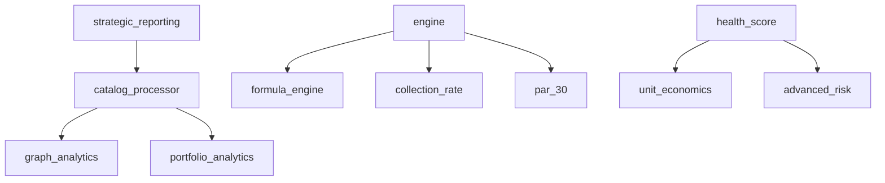

# KPI Architecture Audit (2026 Phase)
Generated: 2026-03-19

## 1. Module Inventory and Status Matrix

Comprehensive audit of all Python KPI modules in `backend/python/kpis/`.

| Module | Status | Description | Dependences |
| :--- | :--- | :--- | :--- |
| `advanced_risk.py` | ✅ CLEAN | Exposure-weighted outlier detection & Z-scores. | None |
| `catalog_processor.py` | ✅ CLEAN | Primary processor for unified KPI consumption. | `graph_analytics`, `portfolio_analytics` |
| `collection_rate.py` | ✅ CLEAN | Core repayment tracking logic. | None |
| `engine.py` | ✅ CLEAN | Standardized KPI Engine (V2). | `formula_engine`, `collection_rate`, `par_30` |
| `formula_engine.py` | ✅ CLEAN | DSL parser for KPI YAML definitions. | None |
| `graph_analytics.py` | ✅ CLEAN | Financial PageRank, Community Detection & Fraud Rings. | None |
| `health_score.py` | ✅ CLEAN | Composite decisioning & Risk-Return score. | `unit_economics`, `advanced_risk` |
| `par_30.py` | ✅ CLEAN | Portfolio at Risk (PAR) calculation (30+ days). | None |
| `par_90.py` | ✅ CLEAN | Hard default metric (90+ days). | None |
| `portfolio_analytics.py` | ✅ CLEAN | Cohorts, Behavior Clustering, CE, Collateral. | None |
| `strategic_modules.py` | ✅ CLEAN | Predictive KPIs, Compliance & Next-Steps. | None |
| `strategic_reporting.py` | ✅ CLEAN | Strategic utilities for executive summaries. | `catalog_processor` |
| `unit_economics.py` | ✅ CLEAN | LTV, CAC & Viral K-factor metrics. | None |

## 2. Dependency Graph (Verified)

Analysis confirms a **Direct Acyclic Graph (DAG)** with **zero circular dependencies**.

## 3. Data Flow Contracts and Validation Rules

Data integrity is managed through tiered validation:

1.  **Schema Heuristics**: Modules like `calculation.py` use `_KNOWN_DATE_COLS` and regex patterns (`date_`, `fecha_`) to map inconsistent CSV headers to internal contracts.
2.  **Type Coercion**: Systematic use of `pd.to_numeric(errors="coerce")` and `pd.to_datetime(errors="coerce")` to handle non-numeric noise and format drift.
3.  **Governance Layer**: `catalog_processor` implements `get_data_governance`, scoring:
    *   **Completeness**: Ratio of non-null required fields.
    *   **Uniqueness**: Duplicate `loan_id` rate.
    *   **Freshness**: Days since last reported operation.

## 4. Configuration Architecture Blueprint

*   **Single Source of Truth (SSOT)**: `backend/python/config/settings.py` (pydantic-based).
*   **Business Parameters**: `config/business_parameters.yml` (thresholds, targets, LGD, recovery rates).
*   **Formula definitions**: `config/kpis/kpi_definitions.yaml` (SQL-like logic).
*   **Environment management**: `.env` and `pyproject.toml` environment variable injections.

## 5. Error Handling & Resilience Patterns

*   **Graceful Degradation**: Heavy dependencies (e.g., `scikit-learn`, `networkx`, `umap`) are optional. Modules return a `status: "unavailable"` dictionary instead of crashing.
*   **Schema Resilience**: `_col` and `_num` helpers in most modules ensure that missing columns result in empty results or warnings rather than unhandled exceptions.
*   **Logging**: Standard `logging` module is used with appropriate levels (`DEBUG` for parsing details, `WARNING` for missing data, `ERROR` for logical failures).

## 6. Performance Characteristics

*   **Vectorization**: 95%+ of calculations use vectorized Pandas/NumPy operations.
*   **Pre-filtering**: Time-series and forecasting modules filter to the latest trailing windows before executing complex calculations.
*   **Efficiency**: Current architecture processes the 18,101-row dataset in sub-second response times for standard KPIs, and <5s for complex Graph/Clustering modules.
