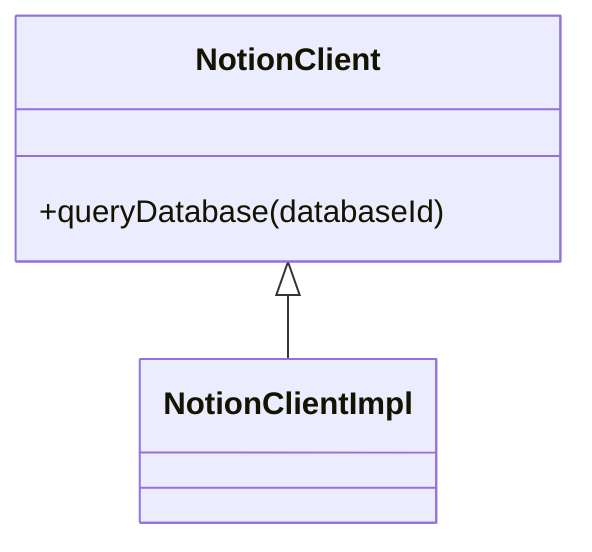
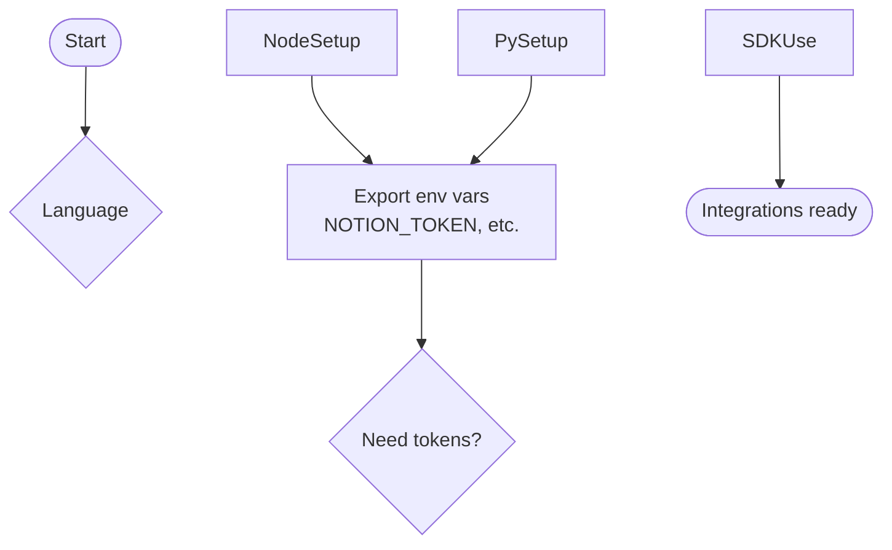

## Environment variables

Export these values before running the examples:

- `NOTION_TOKEN`: Internal integration token for Notion.
- `NOTION_DATABASE_ID`: Database ID for querying Notion content.

```bash
# Mac/Linux shell examples
export NOTION_TOKEN="<token>"
export NOTION_DATABASE_ID="<database_id>"
```

#### Notion client

```ts
import { Client } from '@notionhq/client'

const notion = new Client({ auth: process.env.NOTION_TOKEN })

async function listDatabasePages() {
  const databaseId = process.env.NOTION_DATABASE_ID!
  const response = await notion.databases.query({ database_id: databaseId })
  return response.results.map((page) => page.id)
}
```

## Python setup

### Usage examples (Python)

#### Notion client

```python
from notion_client import Client
import os

notion = Client(auth=os.environ["NOTION_TOKEN"])

def list_database_pages():
    database_id = os.environ["NOTION_DATABASE_ID"]
    response = notion.databases.query(database_id=database_id)
    return [page["id"] for page in response["results"]]
```

## Architecture visuals

### SDK client class diagram



### Integration choice flow


