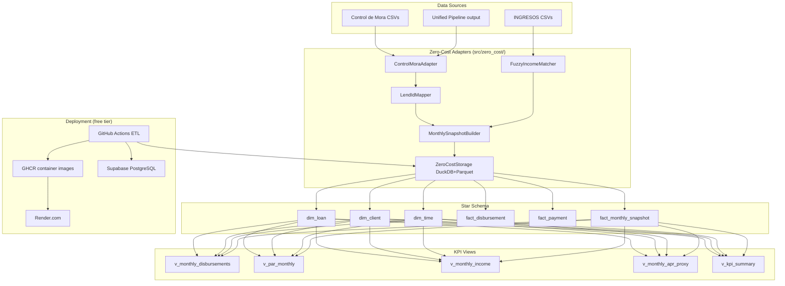

# Migration Guide: Azure → Zero-Cost Architecture

> **Version:** 1.0 · **Date:** 2026-03-16  
> **Branch:** `copilot/migrate-azure-to-free-architecture`  
> **Status:** ✅ Migration artifacts complete — Azure resources NOT touched

---

## Executive Summary

This document describes the migration of Abaco Loans Analytics from a
Microsoft Azure-based deployment to a **zero-cost (or near-zero-cost)**
architecture using exclusively free-tier and open-source services.

> ⚠️ **No Azure resources have been modified or deleted.**  
> All Azure infrastructure (`infra/`, `azure.yaml`, CI/CD workflows) remains
> intact.  This migration adds parallel zero-cost capabilities.  The switch
> can be made gradually and reversed at any time.

---

## 1. Azure Resources Detected

| Resource | File | Replacement |
|----------|------|-------------|
| Azure Container Apps | `azure.yaml`, `infra/main.bicep` | Render / Railway / Fly.io free tiers + GHCR |
| Azure Container Registry | `infra/main.bicep` | GitHub Container Registry (GHCR) |
| Azure Application Insights | `infra/appinsights.bicep` | Prometheus + Grafana (self-hosted) |
| Azure Log Analytics Workspace | `infra/loganalytics-workspace.bicep` | Grafana Loki (optional) |
| Azure Storage Account (Blob) | `infra/main.bicep`, `requirements.txt` | DuckDB + Parquet files + rclone |
| Azure Key Vault | `requirements.txt` (`azure-keyvault-secrets`) | GitHub Secrets + `.env` |
| Azure Monitor / OTel exporter | `requirements.txt` (`azure-monitor-opentelemetry-exporter`) | OpenTelemetry → Prometheus |
| Azure OIDC auth | `.github/workflows/deploy-multicloud.yml` | Removed from new workflows |
| Azure App Service endpoint | `scripts/reporting/generate_strategic_report.py` | Render / Railway URL |
| Azure Container Apps endpoint | `streamlit_app/app.py` | Render / Railway URL |

---

## 2. Target Zero-Cost Architecture

```
┌─────────────────────────────────────────────────────────┐
│                  GitHub (free tier)                      │
│                                                          │
│  ┌──────────────┐  ┌─────────────────┐  ┌────────────┐ │
│  │ GitHub       │  │ GitHub Actions  │  │ GitHub     │ │
│  │ Pages (docs) │  │ (ETL / CI / CD) │  │ Packages   │ │
│  │              │  │                 │  │ (GHCR)     │ │
│  └──────────────┘  └────────┬────────┘  └─────┬──────┘ │
└───────────────────────────────────────────────────────┘
                               │                  │
         ┌─────────────────────▼──────────────────▼──────┐
         │               Compute (free tiers)             │
         │  Render.com  │  Railway.app  │  Fly.io         │
         │  (API + dash) │  (ETL jobs)   │  (API alt)     │
         └─────────────────────────────────────────────────┘
                               │
         ┌─────────────────────▼──────────────────────────┐
         │               Data (free tiers)                 │
         │  Supabase  │  DuckDB+Parquet  │  Neon (alt)    │
         │  (PostgreSQL)│  (local/CI)    │  (serverless)  │
         └─────────────────────────────────────────────────┘
                               │
         ┌─────────────────────▼──────────────────────────┐
         │           Observability (self-hosted)           │
         │  Prometheus  │  Grafana  │  OpenTelemetry       │
         └─────────────────────────────────────────────────┘
```

### Cost Comparison

| Service | Azure Cost | Zero-Cost Alternative | Cost |
|---------|-----------|----------------------|------|
| Container Apps | ~$15–50/mo | Render.com free / Fly.io free | $0 |
| Container Registry | ~$5/mo | GHCR (free for public repos) | $0 |
| Application Insights | ~$2–10/mo | Prometheus + Grafana | $0 |
| Blob Storage | ~$1–5/mo | Local Parquet / Google Drive | $0 |
| Key Vault | ~$0.03/10k ops | GitHub Secrets | $0 |
| Log Analytics | ~$2–8/mo | Grafana Loki (optional) | $0 |
| **Total** | **~$25–80/mo** | | **$0** |

---

## 3. New Files Created

### Python Package: `src/zero_cost/`

| File | Description |
|------|-------------|
| `__init__.py` | Package exports |
| `storage.py` | DuckDB + Parquet storage backend replacing Azure Blob |
| `lend_id_mapper.py` | Bidirectional lend_id ↔ NumeroDesembolso mapping |
| `control_mora_adapter.py` | Control-de-Mora CSV normaliser |
| `monthly_snapshot.py` | Monthly snapshot builder + star schema output |
| `fuzzy_matcher.py` | RapidFuzz income ↔ disbursement name matching |

### Database Schema: `db/star_schema/`

| File | Description |
|------|-------------|
| `create_star_schema.sql` | PostgreSQL DDL for Supabase |
| `duckdb/create_star_schema_duckdb.sql` | DuckDB DDL for local analytics |
| `views/kpi_views.sql` | KPI views (disbursements, PAR, income, APR) |

### Scripts: `scripts/data/`

> **Note:** The scripts below are migration / zero-cost prototype helpers and
> are **not** part of the canonical operations command set. For the
> authoritative list of approved scripts and `make` targets, see
> `docs/operations/SCRIPT_CANONICAL_MAP.md`.

| File | Description |
|------|-------------|
| `init_duckdb_schema.py` | Initialise local DuckDB star schema |
| `build_snapshot.py` | Build monthly snapshot from CSV |

### GitHub Actions Workflows: `.github/workflows/`

| File | Description |
|------|-------------|
| `etl-pipeline.yml` | ETL pipeline (replaces Azure Data Factory) |
| `deploy-free-tier.yml` | Deploy to Render / Railway / Fly.io + GHCR |
| `docs-deploy.yml` | GitHub Pages documentation deployment |

### Docker & Infrastructure

| File | Description |
|------|-------------|
| `docker-compose.zero-cost.yml` | Local stack without Azure dependencies |

### Documentation

| File | Description |
|------|-------------|
| `docs/data_model.md` | Star schema documentation |
| `docs/migration.md` | This document |

---

## 4. Migration Steps (Checklist)

### Phase 1: Schema & Data (Complete ✅)

- [x] Create star schema DDL (PostgreSQL + DuckDB)
- [x] Create KPI views
- [x] Build `ControlMoraAdapter` for CSV normalisation
- [x] Build `LendIdMapper` for lend_id ↔ NumeroDesembolso resolution
- [x] Build `MonthlySnapshotBuilder` for fact table population
- [x] Build `FuzzyIncomeMatcher` for income ↔ disbursement joins
- [x] Create scripts for schema init and snapshot build
- [x] Write unit tests

### Phase 2: CI/CD (Complete ✅)

- [x] Create ETL pipeline GitHub Actions workflow
- [x] Create free-tier deployment workflow (Render / Railway / Fly.io / GHCR)
- [x] Create GitHub Pages docs deployment workflow

### Phase 3: Infrastructure (Ready — Requires Approval)

- [ ] **Approval required:** Configure Render/Railway/Fly.io service
- [ ] **Approval required:** Add secrets to GitHub repository
  - `RENDER_API_KEY`, `RENDER_SERVICE_ID`
  - `RAILWAY_TOKEN`, `RAILWAY_PROJECT_ID`
  - `FLY_API_TOKEN` (if using Fly.io)
  - `SUPABASE_URL`, `SUPABASE_ANON_KEY`, `SUPABASE_SERVICE_ROLE_KEY`
- [ ] **Approval required:** Enable GitHub Pages in repository settings
- [ ] **Approval required:** Remove Azure packages from `requirements.txt` (when ready)

### Phase 4: Cutover (Requires Approval)

- [ ] **Approval required:** Update `streamlit_app/app.py` production URL
- [ ] **Approval required:** Update `scripts/reporting/generate_strategic_report.py` URL
- [ ] **Approval required:** Disable or archive `deploy-multicloud.yml`
- [ ] **Approval required:** Archive `infra/` directory

---

## 5. Running the Zero-Cost Stack Locally

```bash
# Install dependencies (add duckdb and rapidfuzz)
pip install duckdb rapidfuzz pyarrow

# Initialise DuckDB star schema
make zero-cost-schema

# Run ETL pipeline locally
make etl-local

# Build monthly snapshot
make snapshot-build INPUT=data/samples/abaco_sample_data_20260202.csv MONTH=2026-01-31

# Start full local stack (API + Dashboard, no Azure)
make zero-cost-up

# Start with local PostgreSQL (mirrors Supabase)
make zero-cost-db
```

---

## 6. Required Secrets (New Workflows)

| Secret | Required By | Where to Get |
|--------|-------------|--------------|
| `SUPABASE_URL` | ETL pipeline | Supabase project settings |
| `SUPABASE_ANON_KEY` | ETL pipeline | Supabase project settings |
| `SUPABASE_SERVICE_ROLE_KEY` | ETL pipeline | Supabase project settings |
| `RENDER_API_KEY` | deploy-free-tier.yml | Render dashboard → Account → API Keys |
| `RENDER_SERVICE_ID` | deploy-free-tier.yml | Render dashboard → Service settings |
| `RAILWAY_TOKEN` | deploy-free-tier.yml | Railway dashboard → Account → Tokens |
| `FLY_API_TOKEN` | deploy-free-tier.yml | `fly auth token` |

> **Note:** All Azure-related secrets (`AZURE_CREDENTIALS`, etc.) remain
> required for the existing `deploy-multicloud.yml` workflow.  They are NOT
> used by the new zero-cost workflows.

---

## 7. Backward Compatibility

The zero-cost migration is **fully additive**:

- Existing pipeline (`scripts/data/run_data_pipeline.py`) is unchanged
- Existing Azure workflows remain functional
- Existing Supabase integration is unchanged
- New `src/zero_cost/` package can be imported alongside existing code
- All existing tests continue to pass

---

## 8. Fuzzy Matching: Income ↔ Disbursements

The `FuzzyIncomeMatcher` class joins INGRESOS records to desembolsos when
client names differ due to typos or formatting inconsistencies.

```python
from src.zero_cost.fuzzy_matcher import FuzzyIncomeMatcher

matcher = FuzzyIncomeMatcher(threshold=80)
matched = matcher.match(
    income_df,          # INGRESOS CSV
    disbursements_df,   # desembolsos from pipeline
    left_on="nombre_cliente",
    right_on="client_name",
)
# Two-pass: exact on client_id, fuzzy on name for unmatched
matched2 = matcher.match_two_pass(
    income_df,
    disbursements_df,
    exact_key="client_id",
    fuzzy_left="nombre_cliente",
    fuzzy_right="client_name",
)
```

**Dependencies:** `pip install rapidfuzz` (falls back to `difflib` if unavailable)

---

## 9. Architecture Diagram (Mermaid)



