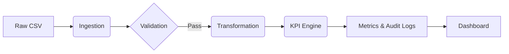

# Source: README.md
# ABACO Financial Intelligence Platform
ABACO delivers an executive-grade analytics and governance stack for lending teams. The platform pairs a Next.js dashboard with Python risk pipelines, Azure deployment scripts, and traceable KPI governance. A dual interface is available: Streamlit for rapid exploration and an automated data pipeline for KPI computation and audit trailing.
## Stack map
- **apps/web**: Next.js dashboard for portfolio, risk, and growth views.
- **infra/azure**: Azure infra-as-code and deployment scripts.
- **data_samples**: Anonymized datasets for repeatable development and testing.
## Observability, KPIs, and lineage
- **KPI catalog**: Use `docs/KPI-Operating-Model.md` to define owners, formulas, and lineage links for every metric; keep PR and issue references for auditability.
- **Dashboards**: Ensure every visualization lists source tables, refresh timestamp, and on-call owner. Target vs. actual, sparkline trends, and SLA badges should be present on executive views.
- **Data quality**: Track null/invalid rates, schema drift counts, ingestion success %, and freshness lag; surface alerts into the dashboard and CI comments.
## Governance and compliance guardrails
- Enforce PR reviews, lint/test gates, and SonarQube quality gates before merging to main.
- Store secrets in GitHub or cloud KMS; never commit credentials or sample PII.
- Require audit logs for dashboard publishes/exports and validate access controls for sensitive fields.
- Align contributions to the `docs/Analytics-Vision.md` narrative to keep KPIs, prompts, and dashboards within fintech standards.
## Getting started
- Validate repository structure before running tooling:
  ```
  deno run --allow-all main.ts
  ```
  `--unstable` is unnecessary in Deno 2.0; add specific `--unstable-*` flags only when required.
- Web: see `apps/web` for Next.js dashboard setup.
- Python quick start:
  ```bash
  pip install -r requirements.txt
  pytest                                    # Test suite
  ```
## Essential knowledge base
- `docs/Analytics-Vision.md`: Vision, Streamlit blueprint, and narrative alignment for KPIs and prompts.
- `docs/KPI-Operating-Model.md`: Ownership, formulas, dashboard standards, lineage, GitHub guardrails, and audit controls.
- `docs/FINTECH_DASHBOARD_WEB_APP_GUIDE.md`: Blueprint for the fintech dashboard UI (Next.js), analytics API (FastAPI), data contracts, and deployment/CI requirements.
- `docs/Copilot-Team-Workflow.md`: Inviting teams to GitHub Copilot, validation/security workflows, and Azure/GitHub/KPI checklists during the Enterprise trial.
- `docs/ContosoTeamStats-setup.md`: Setup, secrets, migrations, Docker validation, and Azure deployment for the bundled ContosoTeamStats .NET 6 Web API.
- `docs/Fitten-Code-AI-Manual.md`: Fitten Code AI installation, GitHub integration, FAQs, and local inference testing.
- `docs/GitHub-Workflow-Runbook.md`: Branching strategy, quality gates, agent coordination, and merge standards for traceable releases.
# Source: DEPLOYMENT.md
# Fintech Factory Agentic Ecosystem - Deployment & Operations Guide
## Quick Start
This document provides deployment instructions, operational procedures, and troubleshooting for the Fintech Factory agentic ecosystem.
## System Architecture
### Core Components
2. **Transformation Layer**: KPI calculations (BigQuery + Python)
3. **Validation Layer**: Reconciliation & drift detection
5. **Agent Orchestration**: Codex, SonarQube, CodeRabbit automation
### 7 Departmental Intelligence Stacks
- **Risk**: Portfolio health, PAR_90 monitoring, early warning systems
- **Compliance**: Regulatory tracking, audit trails, breach detection
- **Finance**: Revenue forecasting, cash flow optimization, profitability analysis
- **Technology**: System performance, infrastructure monitoring, tech debt tracking
- **Growth**: Market expansion, customer acquisition metrics, pipeline analysis
- **Marketing**: Campaign ROI, brand sentiment, customer engagement
- **Sales**: Pipeline velocity, conversion rates, deal analytics
## Deployment Phases
### Phase 1: Foundation (Week 1)
✅ **Completed**
- Data warehouse setup (BigQuery)
- KPI definitions and calculation engines
- Initial monitoring and alerting
### Phase 2: Integration (Week 2)
⏳ **In Progress**
- Email distribution lists
- Meta advertising synchronization
### Phase 3: Agent Orchestration (Week 3)
⏳ **Pending**
- Codex SDK integration for code generation
- SonarQube continuous quality monitoring
- CodeRabbit automated code reviews
- Automated deployment workflows
### Phase 4: Production Ready (Week 4)
⏳ **Pending**
- Load testing and performance tuning
- Security audit and compliance verification
- Stakeholder training and documentation
- Go-live and cutover
## Configuration Files
```
config/
├── integrations/
│   └── meta.yaml             # Ad platform (pending)
├── pipelines/
│   └── data_orchestration.yaml  # Complete ETL workflow
├── kpis/
│   └── kpi_definitions.yaml  # All KPI formulas and thresholds
└── roles_and_outputs.yaml    # Departmental roles and outputs
sql/
├── v_portfolio_risk.sql      # Portfolio health score view
└── models/                   # Additional dimensional models
python/
├── setup.py                  # Package configuration
├── kpi_engine.py            # KPI calculation implementations
├── ingestion/               # Data import modules
├── transform/               # Transformation logic
└── reporting/               # Output generation
```
## KPI Definitions Reference
### Risk Department KPIs
1. **PAR_90** (Portfolio At Risk 90+ Days)
   - Formula: SUM(balance) WHERE days_delinquent > 90 / SUM(total_receivables)
   - Threshold (Critical): > 5.0%
   - Threshold (Warning): > 3.0%
2. **Collection Rate**
   - Formula: SUM(collections_30d) / SUM(receivables_outstanding) \* 100
   - Target: > 2.5% monthly
   - Source: Payment transactions
3. **Portfolio Health Score**
   - Formula: (100 - PAR_90%) × 0.6 + Collection_Rate% × 0.4
   - Range: 0-100 (100 is healthiest)
   - Triggers: Alerts at <50
## Alert Rules
```yaml
Compliance Breach: CRITICAL → All channels + escalation
```
## Operational Procedures
### Daily Monitoring (06:00 UTC)
- Portfolio health snapshot dashboard
- Compliance status review
- Alert triage and response
- Performance metrics check
### Weekly Reviews (Monday 09:00 UTC)
- Executive summary generation
- Risk committee briefing
- Trend analysis and forecasting
- Departmental stakeholder updates
### Monthly Reviews (1st of month)
- Governance review and audit
- KPI accuracy validation
- System performance analysis
- Agent orchestration review
## Troubleshooting
### Data Ingestion Issues
- Check: BigQuery connection and quota
- Action: Retry with exponential backoff (max 3 attempts)
- Escalate: Contact data ops team
### Alert Not Firing
**Problem**: Expected alert not triggered
- Verify: KPI calculation completed successfully
- Verify: Alert rule condition matches data
- Action: Check logs in Cloud Logging
### Report Generation Failed
**Problem**: Stakeholder report not sent
- Verify: All input data available
- Verify: Template files accessible
- Verify: Distribution list valid
- Action: Retry manual generation
## Monitoring Dashboard
**URL**: https://abaco-loans-analytics.vercel.app/dashboard
**Refresh Rate**: Real-time (WebSocket)
**Key Metrics Displayed**:
- Portfolio health score (live)
- PAR_90 percentage trend
- Collection rate performance
- System processing time
- Alert status log
## Support & Escalation
**Level 1**: Automated alert responses
**Level 3**: Executive escalation if PAR_90 > 8% or compliance breach
## Maintenance Windows
- **Database Maintenance**: Sundays 22:00-23:00 UTC
- **Software Updates**: First Tuesday each month
- **Infrastructure Scaling**: As needed, 24-hour notice
## Success Criteria
✅ Zero-touch automation of data pipelines
✅ <5min alert latency from data arrival to stakeholder notification
✅ >99.5% uptime on core systems
✅ 100% KPI accuracy validation
✅ Full audit trail for compliance
✅ All stakeholders informed daily by 06:30 UTC
## Contact
**Architecture Owner**: Fintech Factory Team
**GitHub**: https://github.com/Abaco-Technol/abaco-loans-analytics
**Last Updated**: 2025-01-01
# Source: SECURITY.md
# Security and Audit Log
## Known Vulnerabilities
As of 2025-12-08, the following low-severity vulnerabilities are present in indirect dependencies:
- `cookie <0.7.0` (used by `@azure/static-web-apps-cli`)
- `tmp <=0.2.3` (used by `devcert`)
No fix is currently available. We are monitoring for upstream updates and will patch as soon as possible. These packages are not used in production-critical paths.
## Mitigation Plan
- Monitor for updates and apply patches when available.
- Document and review usage of affected packages.
- Ensure audit logs and traceability for all pipeline steps.
# Source: docs/FINTECH-GOVERNANCE-FRAMEWORK.md
# ABACO — Loan Analytics Platform
## Fintech Governance & Excellence Framework
### Executive Summary
This framework establishes market-leading standards for KPI measurement, traceability, compliance, and operational excellence. It operationalizes "Vibe Solutioning": moving from fragile shortcuts to robust, predictable excellence.
### Core Principles
1. **++Build Integrity++**: Every component withstands scrutiny, scale, and change
2. **++Traceability++**: Every decision, metric, deployment is auditable
3. **++Stability++**: Systems designed for reliability, not just functionality
4. **++Confidence++**: Governance, monitoring, automation eliminate uncertainty
5. **++Excellence++**: Outcomes superior, not merely correct
### I. Strategic KPIs
- Deployment Success Rate: 100% (>98% threshold)
- Code Quality Score: >85 (daily)
- Security Compliance: 100% pass (weekly)
- Data Lineage Coverage: 100% (>95% threshold)
- SLA Adherence: 99.99% (>99.5% threshold)
- Audit Log Completeness: 100% (real-time)
- MTTR: < 15 minutes
- MTBF: > 720 hours
- Change Success Rate: > 98%
### II. Governance Layers
#### Source Code Governance
- Branch protection on `main`
- Mandatory code reviews (2+ approvers)
- Automated quality gates (SonarQube)
- Semantic versioning
#### CI/CD Governance
- All deployments via GitHub Actions
- Environment parity validation
- Automated rollback on failure
- Immutable deployment audit trail
#### Data Governance
- PII masking and encryption
- RBAC access control
- Data lineage tracking
- Retention policies
#### Security Governance
- Secrets management (GitHub/Azure KV)
- OWASP Top 10 compliance
- Dependency vulnerability scanning
- API authentication/authorization
### III. Quality Gates (Mandatory)
- Unit Tests: >85% coverage
- Integration Tests: 100% pass
- Code Quality: SonarQube A minimum
- Security Scan: Zero critical (CodeQL)
- SAST: Zero high severity
- Dependency Check: Zero high CVE (Dependabot)
### IV. Deployment Process
1. Trigger: Merge to `main` or manual dispatch
2. Validation: Automated tests (unit, integration, E2E)
3. Build: Docker image + SCA scanning
4. Deploy: Blue-green to Vercel/Production
### V. Operational Excellence
#### Monitoring & Observability
- Real-time APM (New Relic/Datadog)
- Distributed tracing
- Error tracking with context
- Custom business metrics dashboards
#### Incident Response
- Runbook automation
- Post-mortem requirement (blameless)
- RCA documentation in wiki
### VI. Compliance & Audit
- SOC 2 Type II readiness
- GDPR/CCPA compliance checks
- Quarterly security audits
- Audit log retention: 7 years
### VII. Developer Workflow
#### Pre-Commit
```bash
git add .
npm run lint && npm run test:unit
git commit -m "feat: [description]"
git push origin feature-branch
```
#### GitHub Workflow
```bash
gh pr create --title "[FEATURE]: Description" --body "Closes #issue"
gh pr review --approve --comment "LGTM"
gh pr merge --auto --squash
```
#### Deploy to Production
```bash
vercel --prod
```
#### Git Sync & Merge
```bash
git fetch origin main
git rebase origin/main
git push origin feature-branch -f
gh pr merge --rebase
```
### VIII. Success Metrics
- 0 critical security vulnerabilities in production
- > 99% deployment success rate
- <15 min MTTR
- 100% audit log compliance
- > 90% SLA adherence
- Zero unplanned outages >5 minutes
---
**Last Updated**: December 2025
**Owner**: Engineering Excellence Team
**Review Cadence**: Quarterly
# Source: docs/Supabase-Connection-Pooling.md
# Supabase Connection Pooling Guidance
Using Supabase's connection pooler (PgBouncer) is required for serverless deployments (e.g., Vercel). Direct connections from serverless functions create many short-lived Postgres sessions and quickly exhaust database connection limits.
## Why use the connection pooler
- Reuses a small set of Postgres connections and hands them out per request, preventing connection storms.
- Works over IPv4-only networks and is the recommended production configuration for Vercel deployments.
## Steps to configure
1. **Retrieve the database password** from **Settings → Database → Connection info** in your Supabase project (reset if needed).
2. **Copy the pooler connection string** from **Connection strings → Connection pooling**. It follows the pattern:
   ```
   postgresql://postgres.<project-ref>:<PASSWORD>@aws-0-us-east-1.pooler.supabase.com:5432/postgres
   ```
3. **Store the URI in an environment file** (never hardcode secrets):
   - Create a `.env.local` file at the project root.
   - Add `DATABASE_URL="postgresql://postgres.<project-ref>:<PASSWORD>@aws-0-us-east-1.pooler.supabase.com:5432/postgres"`.
4. **Point your ORM or database client to the environment variable.** For example, in Prisma:
   ```prisma
   datasource db {
     provider = "postgresql"
     url      = env("DATABASE_URL")
   }
   ```
5. **Set the `DATABASE_URL` environment variable in Vercel** (Settings → Environment Variables) for Production (and optionally Preview/Development) using the same pooler URI.
## Git hygiene
Ensure `.gitignore` excludes local env files so secrets are not committed. Add `.env*.local` to the ignore list if it is not already present.
# Source: docs/Vercel-Framework-Recommendation-NEW.md
# Vercel Framework Recommendation for New Deployments
## Summary Recommendation
- **Framework Preset:** Next.js (App Router, Next.js 14+)
- **Why:** Native Vercel optimizations (ISR, Image Optimization, Edge Functions, Middleware), strong SEO/SSR, streaming Server Components for mixed static/dynamic data, and first-class TypeScript support. Ideal for fintech analytics that demands compliance, observability, and rapid iteration.
- **Team Fit:** Assumes proficiency with Next.js/SSR; supports mixed data strategies and enterprise governance (security headers, env management, auditable CI).
## Comparative Analysis (Next.js vs Vite/SPA)
| Dimension                | Next.js (App Router)                                                                                               | Vite/SPA (React)                                                          |
| ------------------------ | ------------------------------------------------------------------------------------------------------------------ | ------------------------------------------------------------------------- |
| Initial Load (FCP/LCP)   | Faster: SSR/SSG + code-splitting; PPR/ISR reduce TTFB and payload                                                  | Slower: full client bundle + hydration gate; relies on aggressive caching |
| SEO Coverage             | Strong: HTML pre-rendered; Metadata API; dynamic routes with ISR                                                   | Weak: CSR-first; needs pre-render hacks; bots may miss dynamic content    |
| Vercel Optimization      | Native: Image Optimization, Edge Functions/Middleware, ISR cache, Analytics/Speed Insights                         | Limited: requires manual CDN/image setup; fewer edge primitives           |
| Real-time/Data           | Server Components stream data; Route Handlers/APIs colocated; Edge auth                                            | Client-only fetching; backend hosted elsewhere; higher latency            |
| Complexity               | Moderate: SSR/RSC patterns, caching strategies, middleware                                                         | Low: familiar SPA patterns only                                           |
| Scalability              | Auto-edge scaling; DB pooling with Route Handlers; multi-region cache                                              | Frontend only; must build/operate separate backend                        |
| Compliance/Observability | Built-in headers, Middleware for auth/A/B testing; Vercel Analytics + Speed Insights; supports logging and tracing | Mostly client-centric; requires extra services for telemetry/compliance   |
## Deployment Strategy on Vercel (Next.js Preset)
1. **Project Settings → General**
   - Root Directory: `apps/web` (for monorepo)
   - Framework Preset: **Next.js**
2. **Build & Install Commands**
   - Install: `npm install` (workspace-aware) or `npm ci`
   - Build: `npm run build` (executes from `apps/web` when Root Directory is set)
   - Dev: `npm run dev`
   - Output Directory: `.next`
3. **Environment & Secrets** (Vercel Dashboard → Environment Variables)
   - `NODE_ENV=production`
   - `DATABASE_URL=<postgres-url>`
   - `NEXT_PUBLIC_API_URL=<public-api>`
   - `NEXT_RUNTIME=experimental-edge` (for edge-first routes, optional)
4. **Recommended next.config.ts settings**
   - Enable `reactStrictMode`, `swcMinify`, and AVIF/WebP images
   - Configure `experimental.serverActions` and `experimental.ppr` for streaming/partial prerendering where safe
   - Harden headers (HSTS, XSS, Referrer-Policy), and prefer Edge Middleware for auth/geo-based rules
5. **CI/CD & Quality Gates**
   - Pre-deploy checks: `npm run lint`, `npm run test` (if defined), `npm run build`
   - Observability: add `@vercel/analytics` and `@vercel/speed-insights` in `app/layout.tsx`
   - Auditing: lockfile in repo; enable branch protection + required checks; use Vercel deployments with GitHub Checks for traceability
6. **Performance & KPI Tracking**
   - Target <2s FCP and <2.5s LCP for landing pages; monitor via Vercel Speed Insights
   - Track cache HIT ratio for ISR/Edge cache; alert on miss spikes
   - Dashboard: surface build duration, error rate, p95 latency, and bundle size per deployment
## Command Snippets (copy/paste)
- **Local build (monorepo aware):**
  ```bash
  cd apps/web && npm run build
  ```
- **Preview deploy via Vercel CLI:**
  ```bash
  vercel --cwd apps/web
  ```
- **Production deploy:**
  ```bash
  vercel --prod --cwd apps/web
  ```
- **Pull envs locally:**
  ```bash
  vercel env pull apps/web/.env.local
  ```
## Why Not Vite/SPA for This Use Case
- Lacks native SSR/ISR, so SEO and initial render speed depend on client hydration.
- Requires separate backend + CDN configuration for images/edge caching, increasing operational surface area.
- Observability, auth, and compliance controls must be stitched together manually rather than leveraging Vercel middleware/Edge Functions.
## Roles & Responsibilities (RACI-style)
- **Product/Analytics:** define KPIs (FCP, LCP, conversion, DAU), instrumentation events, and dashboards.
- **Engineering:** implement Next.js App Router, caching strategy (ISR/PPR), middleware for auth/compliance, and CI gates.
- **DevOps/SRE:** manage Vercel project settings, environment secrets, incident playbooks, and release governance.
- **Security/Compliance:** review headers, data residency, logging/PII handling, and audit trails.
## Continuous Improvement
- Run quarterly performance audits (Lighthouse/Speed Insights); regressions >10% trigger remediation.
- Rotate secrets regularly and enforce least-privilege for Vercel/GitHub tokens.
- Keep Next.js and Vercel CLI updated to inherit platform optimizations and security patches.
# Source: docs/Copilot-Team-Workflow.md
# Copilot and Enterprise Trial Workflow
Documenting GitHub Copilot usage under the Enterprise trial keeps the team aligned, the security practices auditable, and the outcomes professional.
## 1. Copilot invitations
- Go to **Enterprise Settings > GitHub Copilot**.
- Under **Copilot for Business**, add the teammates who will contribute to `abaco-loans-analytics` (backend, analytics, docs, security).
- Share the invitation link; once accepted, confirm they can use Copilot suggestions in VS Code or Cursor.
- Track adoption per sprint (mention it in the Copilot section of the README) so you can compare productivity KPIs.
## 2. Copilot + workflow integration
- Onboarding doc `docs/ContosoTeamStats-setup.md` already points to the main validation steps—mention Copilot there so people know to ask it to summarize SQL migrations, Docker builds, and workflow triggers.
- Ask Copilot to inspect files by referencing them (e.g., “Use @docs/ContosoTeamStats-setup.md to explain how we run `dotnet ef database update`).
- Log any Copilot-assisted code/commands in your project board to keep traceability for audits.
## 3. Advance security while Copilot learns
- Enable code scanning + Dependabot under `Security > Code security`.
- When a security issue appears, assign it via the Dependabot alerts page (link). Note the remediation plan in a README or Jira ticket; if Copilot suggests a fix, mention it in the comment for that alert.
- Keep the security score link near the doc (https://github.com/Abaco-Technol/abaco-loans-analytics/security/dependabot) so anyone can see the 2 high/1 low alerts.
## 4. Enterprise README checklist
- Create (or expand) `Enterprise-README.md` to summarize: Copilot access, validation branch workflow, Azure free-tier resources used (App Service F1, ACR Basic, Storage), and the GitHub Actions run (`ci-main.yml`).
- Include tenant/subscription details (`abacocapital.co`, subscription `cb1e8785-2893-47a1-be44-d47e13447054`) and the requirement to keep deployments in that scope.
- Outline how to invite members, run scans, and call Copilot with the sample prompts below.
## 5. Sample Copilot prompt
> “I’m working on `abaco-loans-analytics`. Please review `.github/workflows/ci-main.yml`, ensure the Docker image build/push steps are clearly described, and help me document the deployment workflow (ACR, App Service, SQL migrations, Swagger validation). Keep everything inside the free Azure trial, note the KPIs we monitor, and suggest automation improvements for the next sprint.”
Use this prompt to keep Copilot-guided work structured, traceable, and aligned with your fintech-grade outcomes.
# Source: docs/Fitten-Code-AI-Manual.md
# Fitten Code AI Assistant Manual
## Product overview
Fitten Code AI (by Fittentech) is a developer-focused coding assistant that can handle code reviews, test suggestions,
deployment script generation, and more across local and cloud environments. This guide helps the
`abaco-loans-analytics` repo integrate Fitten Code AI end-to-end, from development through deployment.
## Installation steps
1. Prepare the basics: Git, Python 3.10+, Node.js (for the web project), Docker (optional for containerization).
2. Download the Fitten Code AI model and config to secure storage—do not commit them to Git. Per your org policy, place
   them under `/opt/fitten/models`, a shared volume, or a model server.
3. Create `fitten.config.toml` (or the org-approved file) at the repo root and point it to the model path:
   ```toml
   [model]
   path = "/absolute/or/network/path/to/fitten-model"
   cache_dir = ".fitten/cache"
   ```
4. Install the Fitten CLI or SDK (example):
   ```bash
   pip install fitten-cli
   fitten login        # add if authentication is required
   ```
5. Add Fitten commands or scripts to `package.json` `scripts` (web) or the `Makefile` (analytics) so developers can run
   them with one command.
## Feature highlights
- **Instant code analysis**: runs automatically in PRs, commits, or CI and provides inline-style feedback.
- **Deployment assistant**: generates deployment summaries, Azure scripts, and CI/CD configs to reduce ops friction.
- **Developer guidance**: tailored recommendations for `apps/web` and `apps/analytics`, including testing coverage tips
  and model performance checks.
- **Multi-tool integration**: works with GitHub Actions, Azure Pipelines, and the Fitten local CLI to close the
  develop–test–deploy–monitor loop.
## Local and GitHub integration tips
1. Local: set the `FITTEN_CONFIG` environment variable in your shell so Fitten CLI can read `fitten.config.toml`. Use
   commands like `fitten sniff apps/web` to scan subprojects as needed.
   notifications.
3. Deployment: Fitten can generate Azure/Vercel deployment notes and autofill variables using the scripts under
   `infra/azure`.
   is tracked to closure.
## FAQ
- **Q: Do Fitten models have to live in the repo?**
  A: No. Do not commit model files. Just store the path in `fitten.config.toml` and download or mount in CI if needed.
- **Q: How do I debug Fitten’s suggestions?**
  A: Run `fitten explain <file>` locally, use `--preview` to inspect context, and mark whether suggestions are accepted
  in the PR.
- **Q: How does Fitten work with SonarCloud or OpenAI?**
  A: Use Fitten as the first review layer, then run SonarCloud for static analysis. OpenAI can handle more complex
  generation; they complement one another.
## Contact
Fittentech (Fitten Code) technical support:
- Website: https://www.fittentech.com/
- Fitten Code platform: https://code.fittentech.com/
- Reach out via the platform or corporate email for licensing and help.
## Useful links
- Fitten Code platform: https://code.fittentech.com/
- Fittentech corporate site: https://www.fittentech.com/
- `abaco-loans-analytics` repository (this page): https://github.com/9nnxqzyq4y-eng/abaco-loans-analytics
## Test local inference
After confirming the model path, you can quickly validate Fitten local inference with Hugging Face Transformers:
```python
from transformers import AutoTokenizer, AutoModelForCausalLM
model_path = "/absolute/or/network/path/to/fitten-model"
tokenizer = AutoTokenizer.from_pretrained(model_path)
model = AutoModelForCausalLM.from_pretrained(model_path)
prompt = "Fitten Code AI makes coding more confident."
inputs = tokenizer(prompt, return_tensors="pt")
outputs = model.generate(**inputs, max_new_tokens=64)
print(tokenizer.decode(outputs[0], skip_special_tokens=True))
```
If the model is not local, download it in CI (for example, with `wget` + `unzip`) and pass the path to the
`huggingface` API or Fitten CLI. This run is only to ensure the model loads, the tokenizer is readable, and the
inference loop is wired correctly.
# Source: docs/ContosoTeamStats-setup.md
# ABACO — Loan Analytics Platform
## ContosoTeamStats Local Development Guide
This service-oriented API is built with .NET 6, backed by SQL Server, containerized with Docker, and wired to Azure services, SendGrid, and Twilio. Follow this guide to provision the required tools, configure secrets, and run the API locally before relying on the automated GitHub Actions workflow for Azure deployments.
### Prerequisites
Install the following on your workstation:
- **.NET 6 SDK** – required to build and run the ContosoTeamStats Web API. Download from the [.NET 6.0 download page](https://dotnet.microsoft.com/download/dotnet/6.0).
- **IDE** – Visual Studio 2022 (Community is fine) or VS Code with the C# Dev Kit extension for editing, debugging, and working with solution files.
- **Docker Desktop** – builds and runs the containerized app, and it can also host a SQL Server container if you prefer not to install SQL Server locally.
- **SQL Server** – either SQL Server Express with Management Studio (SSMS) or a SQL Server container. The app uses Entity Framework Core migrations, so you need a reachable SQL Server instance before running `dotnet ef database update`.
### Optional Azure Tooling
For parity with the cloud workflow and GitHub Actions deployment (.github/workflows/main.yml), create these Azure resources using a free Azure account:
| Resource                           | Purpose                                               | Free option                                                                                      |
| ---------------------------------- | ----------------------------------------------------- | ------------------------------------------------------------------------------------------------ |
| **Azure SQL Database**             | Host the production database.                         | Choose the Serverless compute tier for generous free monthly grants.                             |
| **Azure App Service**              | Host the Docker container in Azure.                   | Create an App Service Plan on the F1 (Free) tier and set the publish method to Docker Container. |
| **Azure Container Registry (ACR)** | Store the Docker image pushed by CI.                  | Basic tier is very low cost; it works well for dev/test pipelines.                               |
| **Azure Storage Account**          | Store blobs such as team logos or other file uploads. | General Purpose v2 includes a free tier (5 GB storage, 20K transactions/month).                  |
### Step-by-step Local Setup
#### 1. Fill in `appsettings.Development.json`
Populate the configuration file with the services you plan to consume. Example snippet:
```json
{
  "Logging": {
    "LogLevel": {
      "Default": "Information",
      "Microsoft.AspNetCore": "Warning"
    }
  },
  "ConnectionStrings": {
    // Option A: Local SQL Server
    "SqlConnectionString": "Server=localhost\\SQLEXPRESS;Database=ContosoTeamStats;Trusted_Connection=True;MultipleActiveResultSets=true"
    // Option B: Azure SQL Database (swap the URI shown in the Azure portal)
    // "SqlConnectionString": "Server=tcp:your-server-name.database.windows.net,1433;Initial Catalog=your-db-name;..."
  },
  "SendGridKey": "YOUR_SENDGRID_API_KEY",
  "Twilio": {
    "AccountSid": "YOUR_TWILIO_SID",
    "AuthToken": "YOUR_TWILIO_TOKEN",
    "PhoneNumber": "+15551234567"
  },
  "StorageConnectionString": "YOUR_AZURE_STORAGE_CONNECTION_STRING"
}
```
Use secrets or environment variables in your IDE to keep API keys and connection strings out of source control.
#### 2. Prepare the Database
From the repo root, run:
```bash
dotnet ef database update
```
This applies the Entity Framework Core migrations against the configured `SqlConnectionString` and creates the needed schema.
If you prefer Docker for SQL Server, start a container such as:
```bash
docker run -e "ACCEPT_EULA=Y" -e "SA_PASSWORD=Your@Passw0rd" -p 1433:1433 --name sqlserver -d mcr.microsoft.com/mssql/server:2019-latest
```
Then point `SqlConnectionString` to `Server=localhost,1433;User Id=sa;Password=Your@Passw0rd;...`.
#### 3. Run the API Locally
- In Visual Studio, hit the Run button (select the ContosoTeamStats project or Docker profile as needed).
- From the terminal: `dotnet run` from the project directory.
Swagger will be available at `https://localhost:<port>/swagger`, which you can use to play with endpoints and verify that data flows to/from SQL Server, SendGrid, Twilio, and Azure Storage.
#### 4. Container and Azure Validation
- Build the Docker image locally:
```bash
docker build -t contoso-team-stats .
```
- Run it against your local SQL Server or Azure SQL using environment overrides (pass connection strings via `-e` flags or a `.env` file).
- If you configure Azure services, confirm the values match what the GitHub Actions workflow expects so CI/CD can push to your ACR and deploy to App Service.
### Automating Configuration
- Store secrets in a `.env` file and load them with a script (for example, `set -a && . .env && set +a` on macOS/Linux) before running `dotnet run`.
- Add a `docker-compose.yml` that declares the API service plus SQL Server, allowing `docker compose up` to wire everything together for faster validation.
- Use the Azure CLI to automate resource creation (`az sql db create`, `az acr create`, `az webapp create`, etc.) matching the workflow's expectations.
### Post-setup Checklist
1. Verify the sync service is running (if applicable).
2. Run the application and call a few endpoints via Swagger or Postman.
3. Ensure test objects land in SQL Server and that SendGrid/Twilio/Storage calls succeed (use sandbox test accounts if available).
4. Once everything looks good, expand OU filtering and sync in the Azure AD Connect scenario described earlier before scaling up the sync scope.
### Reproducible Validation Steps
Run these commands sequentially to confirm the documentation works:
```bash
# Ensure env vars are loaded (adjust for your shell if not bash/zsh)
set -a && . .env && set +a
# Confirm Entity Framework migrations apply cleanly
dotnet ef database update
# Start the API as described earlier
dotnet run
# While the API runs, hit a Swagger endpoint (substitute the port from the console)
curl -k https://localhost:5001/swagger/index.html
```
Leave `dotnet run` running while you manually explore the Swagger UI or Postman to confirm SQL Server, SendGrid, Twilio, and Storage interactions behave as expected.
### Container Diligence and GitHub Actions Verification
Use the commands below to build the Docker image, push it to Azure Container Registry, and run the GitHub workflow tied to that image. Replace placeholders with your actual ACR name and workflow branch.
```bash
# Build locally
docker build -t contoso-team-stats:local .
# Tag for ACR (replace with your registry)
docker tag contoso-team-stats:local <your-registry>.azurecr.io/contoso-team-stats:latest
# Login and push
az acr login --name <your-registry>
docker push <your-registry>.azurecr.io/contoso-team-stats:latest
# Push docs/changes to trigger workflow
git checkout -b validation/contoso-team-stats
git add docs/ContosoTeamStats-setup.md README.md
git commit -m "docs: document ContosoTeamStats validation"
git push -u origin validation/contoso-team-stats
# Trigger GitHub Actions workflow (GH CLI or portal)
gh workflow run main --ref validation/contoso-team-stats
```
After the workflow finishes, review the GitHub run summary plus Azure portal logs to confirm the image landed in ACR and the App Service deployment succeeded.
# Source: docs/architecture.md
# System Architecture
## Overview
The ABACO Financial Intelligence Platform is designed as a modular, Python-based analytics engine that processes loan portfolio data to generate actionable KPIs and visualizations.
## Components
### 1. Core Logic (`python/`)
The business logic is isolated from the presentation layer to ensure testability and reusability.
- **Ingestion**: `ingestion.py` handles loading data from CSVs, applying timestamps, and tracking run IDs.
- **Validation**: `validation.py` enforces schema constraints (required columns, numeric types).
- **Transformation**: `transformation.py` normalizes data structures for KPI calculation.
- **KPI Engine**: `kpi_engine.py` orchestrates the calculation of PAR30, PAR90, Collection Rate, and Portfolio Health.
- **Financial Analysis**: `financial_analysis.py` provides advanced metrics like HHI (concentration risk) and weighted averages.
### 2. Data Pipeline (`scripts/run_data_pipeline.py`)
A linear pipeline that executes the following stages:
1.  **Ingest**: Load raw CSV data.
2.  **Validate**: Check for critical data quality issues.
3.  **Transform**: Prepare data for calculation.
4.  **Calculate**: Compute KPIs using the Engine.
5.  **Output**: Save results to `data/metrics/` (Parquet/CSV) and logs to `logs/runs/`.
### 3. Dashboard (`streamlit_app.py`)
A Streamlit application that serves as the frontend for:
- Interactive data exploration.
- Visualizing growth projections.
- Exporting reports and slide payloads.
## Data Flow

# Source: docs/CEO_OPERATING_SYSTEM_v2_EXECUTIVE.md
# CEO Operating System v2 — Executive Presentation (Oct-16, 2025)
## Scale confirmation
- **Scale:** Thousands (K). Sep-2025 AUM = **$7,368K** (baseline), Dec-2026 target = **$16,419K**.
- **Pattern:** Explicit month-by-month non-linear path (tough Q4-2025 trough, sharp Q1-2026 rebound, volatile Q2, acceleration Q3, consolidation Q4).
## Where we are today (Oct-16, 2025)
- **Current AUM:** $7,368K (Abaco Technologies ~$7,368K; Abaco Financial effectively $0 after Sep-2025 collapse, ~91% churn).
- **Customers:** 56 active SMEs (Abaco Tech 53, Abaco Financial 3). Churn ~25%/month on Tech; need +444 net new to reach 500 by Dec-2026.
- **Portfolio composition (by line bucket):**
  - > $200K: 19.87% ($9.4MM) — concentration risk.
  - $150–200K: 15.45% ($7.0MM).
  - $75–100K: 13.01% ($6.1MM).
  - $50–75K: 12.92% ($6.1MM).
  - $25–50K: 12.06% ($5.7MM).
  - $10–25K: 12.06% ($5.7MM).
  - $100–150K: 6.35% ($2.9MM).
  - <$10K: 5.31% ($2.5MM).
  - Unassigned: 2.95% ($1.4MM) — classify by Nov-2025.
- **Concentration:** Top-10 payers ~19.87% (below 30% covenant). Single-obligor ~4% ceiling respected.
- **Repayment pattern:** MOB1 8.50%; MOB2 43.98% (52.48% cumulative); MOB3 28.05% (80.53% cumulative); MOB4+ 17.81%; principal loss 1.66%; rotation 5.5x; embedded interest ~7.60% take-rate.
- **Default/DPD:**
  - Abaco Financial: high risk (multiple >90 DPD across sizes) — wind-down/contain.
  - Abaco Technologies: ~3–4% default, manageable; monitor >$150K segment.
- **Data quality:** ~78% complete; missing KAM assignments and some collateral details; ready for risk analysis and forecasting.
## Where we are going (Dec-2026 target)
- **AUM path (K):**
  - Sep-25 7,368 → Oct-25 7,171 (-197) → Nov-25 6,819 (-352) → Dec-25 6,465 (-354, trough)
  - Jan-26 8,736 (+2,271 inflection) → Feb-26 8,814 (+78) → Mar-26 10,364 (+1,550)
  - Apr-26 10,166 (-198) → May-26 11,629 (+1,463) → Jun-26 11,419 (-210)
  - Jul-26 12,960 (+1,541) → Aug-26 12,860 (-100) → Sep-26 14,503 (+1,643)
  - Oct-26 14,511 (+8) → Nov-26 16,276 (+1,765) → Dec-26 16,419 (+143 consolidation)
- **Phases:**
  - Q4-2025 Trough (seasonal + acquisition lag): -$903K from Sep baseline; prep platforms (LoanPro, Taktile, CRM) and embedded negotiations.
  - Q1-2026 Sharp Ramp: +$3,899K; embedded channels go live; 4 KAMs active; digital ramp.
  - Q2-2026 Volatile Growth: +$1,055K net; manage prepayment/churn; enforce Top-10 <30% and diversify buckets.
  - Q3-2026 Acceleration: +$3,084K; embedded channels 50–60% of originations; 300+ active customers; rotation stable.
  - Q4-2026 Consolidation: +$1,916K; shift to profitability, margin optimization, Series B readiness.
- **Customers:** Target 500 active SMEs (56 → 500 = 8.9x). Acquisition 35–40/month baseline rising to 50–60/month H1-2026; churn down to 15%; 5–10 reactivations/month.
- **Revenue/EBITDA (2026 ramp):** $2–3MM annual revenue equivalent with $50–100K EBITDA by Q4-2026; steady-state potential $270–390MM with 27%+ margins.
- **Defaults:** Maintain <1.5% per cohort (covenant ≤4%).
- **Rotation:** Sustain ≥4.5x (currently 5.5x).
## TAM and funnel
- **TAM:** LatAm B2B invoice market ~$200B; 3–5% factoring penetration → $6–10B; embedded capture ~1% → $60–100MM; Abaco 2026 target $16.4MM AUM = 16–27% of embedded slice.
- **Funnel (Sep-2025 → Dec-2026):**
  - Market: ~500K SMEs (payables $50–200K/month).
  - Aware: 155K SMEs (KAM + digital + embedded reach).
  - Registered: 56 now → 500 target (0.036% → 0.32% of aware).
  - Active: 56 now → 400 target (80% of registered).
  - Factoring: 56 now → 500 target (AUM per customer drops from $131K to ~$32.8K to favor small-bucket growth).
- **Government factoring:** None today; plan B2G pilot in 2027 after regulatory prep.
## Portfolio rebalancing targets (to reach $16.4MM)
- Shift growth to <$50K buckets with best LTV:CAC and diversification; reduce concentration in >$200K and $150–200K.
- Bucket deltas (current → target):
  - <$10K: $2.5MM → $4.0MM (+$1.5MM)
  - $10–25K: $5.7MM → $9.0MM (+$3.3MM)
  - $25–50K: $5.7MM → $8.5MM (+$2.8MM)
  - $50–75K: $6.1MM → $8.0MM (+$1.9MM)
  - $75–100K: $6.1MM → $7.0MM (+$0.9MM)
  - $100–150K: $2.9MM → $3.0MM (+$0.1MM)
  - $150–200K: $7.0MM → $6.5MM (-$0.5MM)
  - > $200K: $9.4MM → $8.4MM (-$1.0MM)
- Outcome: +$9.0MM net growth while keeping Top-10 <30%, improving LTV:CAC, and reducing default risk.
## OKRs by phase (operator view)
- **Q4-2025 Trough:**
  - O: Stabilize portfolio and ready platforms for ramp.
  - KR: LoanPro/Taktile/CRM live by Dec; data completeness ≥95%; churn flat MoM; embedded ISV agreements signed; classify 100% “Unassigned” lines.
- **Q1-2026 Sharp Ramp:**
  - O: Achieve inflection with embedded channels and KAM scale.
  - KR: +$3.9MM AUM vs Dec; 100+ new customers; STP ≥80%; CAC trending down; two ISVs live; 4 KAMs producing.
- **Q2-2026 Volatile Growth:**
  - O: Grow through volatility with risk controls.
  - KR: Net +$1.0MM AUM; Top-10 <30%; NRR >115%; concentration for >$200K down ≥2pp; early-warning coverage for 100% of accounts.
- **Q3-2026 Acceleration:**
  - O: Scale embedded channels and hit momentum targets.
  - KR: +$3.0MM AUM; 300+ active customers; embedded share 50–60% of originations; default <1.5%; rotation ≥5x.
- **Q4-2026 Consolidation:**
  - O: Lock profitability and Series B narrative.
  - KR: +$1.9MM AUM; EBITDA margin >20%; LTV:CAC >4:1; >$200K share below 20%; churn ≤15%.
## Immediate actions (next 30 days)
- Confirm scale (thousands) and finalize month-by-month non-linear path as above.
- Wind down Abaco Financial exposures; focus growth engine on Abaco Tech with <$50K priority buckets.
- Deploy platform stack (LoanPro, Taktile, CRM) and embedded ISV integrations by December.
- Complete data cleanup (KAM ownership, collateral, unassigned lines) to reach ≥95% data quality.
- Stand up weekly reporting on AUM path, funnel conversion, Top-10 concentration, and default <1.5% guardrail.
# Source: docs/codex-workflow-smoketest.md
# Codex Workflow Smoke Test
This file exists to trigger PR workflows and confirm Codex automation is running end-to-end.
- Purpose: workflow health check only; no product impact.
- Expected:
  - PR assignee check
  - Codex review
  - Gemini review
  - Vercel preview (may fail if config incomplete)
  - SonarCloud
# Source: docs/dependabot-private-packages.md
# Configure Dependabot for Abaco private GitHub Packages
Use these steps to let Dependabot authenticate to the private GitHub Packages feeds that the Abaco Loans Analytics repo depends on. Use the exact repository scope and secret name below so Dependabot can reach the Abaco organization packages.
## 1) Create a read-only Personal Access Token (PAT)
- In GitHub, open **Settings → Developer settings → Personal access tokens → Fine-grained tokens**.
- Click **Generate new token** and name it **abaco-dependabot-gh-packages**.
- Scope the token to **Abaco-Technol/abaco-loans-analytics** (and any other private package repos Dependabot must read).
- Under **Repository permissions**, set **Packages** to **Read-only** and leave other permissions at **No access**.
- Set an expiration date, then **Generate token** and copy it immediately.
## 2) Store the token as a Dependabot secret
- In this repo, go to **Settings → Secrets and variables → Dependabot → New repository secret**.
- Name the secret **ABACO_GITHUB_PACKAGES_TOKEN** and paste the PAT value.
- Save the secret so Dependabot can read it during updates.
## 3) Reference the secret from `.github/dependabot.yml`
Add the GitHub Packages registry under the top-level `registries` key and point the npm ecosystem to it:
```yaml
# .github/dependabot.yml
version: 2
registries:
  npm-abaco-github:
    type: npm-registry
    url: https://npm.pkg.github.com/Abaco-Technol
    token: ${{secrets.ABACO_GITHUB_PACKAGES_TOKEN}}
updates:
  - package-ecosystem: 'npm'
    directory: '/'
    schedule:
      interval: 'weekly'
    registries:
      - npm-abaco-github
```
## Notes
- Dependabot resolves private scopes in `package.json`/`.npmrc` against `https://npm.pkg.github.com/Abaco-Technol` when the registry is declared as above.
- Keep the secret name stable (`ABACO_GITHUB_PACKAGES_TOKEN`) so CI and docs reference the same credential. Rotate the PAT before it expires and update the secret with the new value.
# Source: docs/Abaco_2026_North_Star_Metric_Strategy.md
# 🧭 Abaco 2026 — North Star Metric Strategy (NSM)
## 1. Executive summary
**Goal:**
Align the organization around a single metric that captures value creation and sustainable growth for the B2B factoring business.
**Recommended NSM:**
> **Weekly/Monthly Recurrent TPV from Active Clients**
This measures the total processed volume from clients who repeat, reflecting retention, expansion, and portfolio health. It is actionable every week and directly connected to revenue, risk, and governance.
**How it connects to execution:**
- Anchors the origination → cashflow funnel (pancake/replines) by measuring only clients who repeat and generate collections.
- Uses existing guardrails (rotation ≥4.5×, default/NPL <4%, Top-10 concentration ≤30%, single-obligor ≤4%).
- Feeds weekly/monthly board-pack and operational dashboard monitoring (alerts for concentration, DPD/NPL, TPV drops by bucket or channel).
## 2. Context and strategic theses
## 1. Executive summary
**Goal:**
Align the organization around a single metric that captures value creation and sustainable growth for the B2B factoring business.
**Recommended NSM:**
> **Weekly/Monthly Recurrent TPV from Active Clients**
This measures the total processed volume from clients who repeat, reflecting retention, expansion, and portfolio health. It is actionable every week and directly connected to revenue, risk, and governance.
**How it connects to execution:**
- Anchors the origination → cashflow funnel (pancake/replines) by measuring only clients who repeat and generate collections.
- Uses existing guardrails (rotation ≥4.5×, default/NPL <4%, Top-10 concentration ≤30%, single-obligor ≤4%).
- Feeds weekly/monthly board-pack and operational dashboard monitoring (alerts for concentration, DPD/NPL, TPV drops by bucket or channel).
## 2. Context and strategic theses
1. **Target market:** Formal SMEs using accounts receivable for liquidity; e-invoicing adoption eases origination and monitoring.
2. **Competitive edge:** Debtor-centric risk engine and pricing segmented by CreditLineCategory (A–H).
3. **Strategic shift:** Move from measuring only origination to measuring recurrent platform usage and portfolio quality.
4. **Prior gap:** Tracking focused on invoices originated per month; it missed recurrence, expansion, and real cashflow.
## 3. Value engine and key indicators
| Stage | SME action | Value to Abaco | Related metrics |
| --- | --- | --- | --- |
| Acquisition | Onboarding and first operation | New clients | Monthly new logos by segment (Micro/Small/Medium) |
| Engagement | Recurrent factoring usage | Recurrent TPV | **NSM:** Weekly/Monthly Recurrent TPV |
| Conversion | Invoice financing | Revenue and margin | % invoices financed, weighted APR |
| Retention/Expansion | Credit-line upsell | Higher LTV | TPV per recurrent client, bucket upgrades |
| Portfolio health | Collections and cures | Controlled risk | Default rate, DPD/NPL, debtor concentration |
## 4. Definition and calculation
**Metric:** Recurrent TPV from active clients (weekly/monthly).
- **Active clients:** Clients with ≥1 operation in the measurement window.
- **Recurrent:** Clients with ≥2 consecutive periods with TPV > 0 or those returning after ≥90 days (recovered).
- **Calculation:** Sum of Disbursement Amount of financed invoices from recurrent clients in the window.
**Supporting indicators:**
## 3. Value engine and key indicators
| Stage               | SME action                     | Value to Abaco     | Related metrics                                   |
| ------------------- | ------------------------------ | ------------------ | ------------------------------------------------- |
| Acquisition         | Onboarding and first operation | New clients        | Monthly new logos by segment (Micro/Small/Medium) |
| Engagement          | Recurrent factoring usage      | Recurrent TPV      | **NSM:** Weekly/Monthly Recurrent TPV             |
| Conversion          | Invoice financing              | Revenue and margin | % invoices financed, weighted APR                 |
| Retention/Expansion | Credit-line upsell             | Higher LTV         | TPV per recurrent client, bucket upgrades         |
| Portfolio health    | Collections and cures          | Controlled risk    | Default rate, DPD/NPL, debtor concentration       |
## 4. Definition and calculation
**Metric:** Recurrent TPV from active clients (weekly/monthly).
- **Active clients:** Clients with ≥1 operation in the measurement window.
- **Recurrent:** Clients with ≥2 consecutive periods with TPV > 0 or those returning after ≥90 days (recovered).
- **Calculation:** Sum of Disbursement Amount of financed invoices from recurrent clients in the window.
**Supporting indicators:**
- Financing rate over submitted invoices
- Repeat rate (clients with operations in ≥2 consecutive periods)
- 12m cash-weighted rotation and replines vs plan
- Debtor and client concentration (single-obligor ≤4%, Top-10 ≤30%)
- Default rate 180+ and DPD>15
- Mix-weighted APR by CreditLineCategory
## 5. Alignment with 2025-2026 OKRs
| Objective | NSM-aligned key results | Owner |
| --- | --- | --- |
| Grow with risk control | AUM $7.4M→$16.3M; rotation ≥4.5×; NPL180+ <4%; real default <4%; Top-10 concentration ≤30% | CEO/CRO/CFO |
| Profitability and liquidity | Weighted APR 34–40%; cost of debt ≤13%; DSCR ≥1.2×; utilization 75–90% | CFO |
| Bucketed go-to-market | ≥1 close/KAM/month in $50–150k; upgrades $10–50k→$50–150k; MQL→SQL ≥35–50%; ≤$10k close rate ≥30% | Head of Sales/Head of Growth |
| Production-grade platform | Decision SLA ≤24h, funding SLA ≤48h in ≥90%; live rotation/replines/DPD/NPL panels; SLO ≥99.5% | CTO |
| Portfolio health & collections | CE 6M ≥96%; replines deviation by bucket ±2 p.p.; losses within band (<4%) | Head of Risk |
## 6. Governance and cadence
- **Monitoring:** Weekly (operational) and monthly (board pack) for the NSM and supporting KPIs.
- **Ownership:** NSM DRI: Head of Growth + CEO; Data maintains dashboards; Risk/Finance validate covenants.
- **Alerts:** Concentration breaches, DPD/NPL spikes, replines deviation, TPV drops by segment or channel.
## 7. Risks and mitigations
| Risk | Mitigation |
| --- | --- |
| Recurrence drop in smaller buckets (G–H) | Adjust pricing/score, reinforce onboarding and reminders; prioritize prime debtors |
| Concentration in a few debtors | Debtor limits, automated alerts, and origination rebalance |
| Misalignment between origination and cashflow | Replines and cash-weighted rotation as guardrails; compare plan vs actual weekly |
| Data quality on invoices/collateral | DTE integration, automated validations, 100% assignment audit |
## 8. Why not use other metrics as the central NSM
- **Invoices originated per month:** Measures acquisition and gross volume only; misses recurrence, quality, and cashflow. Fintechs such as Fundbox, BlueVine, and Kredito24 moved from this to recurrent TPV as they scaled.
- **LTV/CAC:** Critical for unit economics and investor reporting, but slow and aggregated; it does not govern weekly pulse or portfolio quality. SaaS/fintech leaders use it as a complementary metric, not as the NSM.
## 9. NSM benchmarks in the industry
- **Recurrent TPV/GMV:** Stripe, Square, PayPal, Shopify, MercadoPago, Konfio.
## 10. Next steps
## 5. Alignment with 2025-2026 OKRs
| Objective                      | NSM-aligned key results                                                                           | Owner                        |
| ------------------------------ | ------------------------------------------------------------------------------------------------- | ---------------------------- |
| Grow with risk control         | AUM $7.4M→$16.3M; rotation ≥4.5×; NPL180+ <4%; real default <4%; Top-10 concentration ≤30%        | CEO/CRO/CFO                  |
| Profitability and liquidity    | Weighted APR 34–40%; cost of debt ≤13%; DSCR ≥1.2×; utilization 75–90%                            | CFO                          |
| Bucketed go-to-market          | ≥1 close/KAM/month in $50–150k; upgrades $10–50k→$50–150k; MQL→SQL ≥35–50%; ≤$10k close rate ≥30% | Head of Sales/Head of Growth |
| Production-grade platform      | Decision SLA ≤24h, funding SLA ≤48h in ≥90%; live rotation/replines/DPD/NPL panels; SLO ≥99.5%    | CTO                          |
| Portfolio health & collections | CE 6M ≥96%; replines deviation by bucket ±2 p.p.; losses within band (<4%)                        | Head of Risk                 |
## 6. Governance and cadence
- **Monitoring:** Weekly (operational) and monthly (board pack) for the NSM and supporting KPIs.
- **Ownership:** NSM DRI: Head of Growth + CEO; Data maintains dashboards; Risk/Finance validate covenants.
- **Alerts:** Concentration breaches, DPD/NPL spikes, replines deviation, TPV drops by segment or channel.
## 7. Risks and mitigations
| Risk                                          | Mitigation                                                                         |
| --------------------------------------------- | ---------------------------------------------------------------------------------- |
| Recurrence drop in smaller buckets (G–H)      | Adjust pricing/score, reinforce onboarding and reminders; prioritize prime debtors |
| Concentration in a few debtors                | Debtor limits, automated alerts, and origination rebalance                         |
| Misalignment between origination and cashflow | Replines and cash-weighted rotation as guardrails; compare plan vs actual weekly   |
| Data quality on invoices/collateral           | DTE integration, automated validations, 100% assignment audit                      |
## 8. Why not use other metrics as the central NSM
- **Invoices originated per month:** Measures acquisition and gross volume only; misses recurrence, quality, and cashflow. Fintechs such as Fundbox, BlueVine, and Kredito24 moved from this to recurrent TPV as they scaled.
- **LTV/CAC:** Critical for unit economics and investor reporting, but slow and aggregated; it does not govern weekly pulse or portfolio quality. SaaS/fintech leaders use it as a complementary metric, not as the NSM.
## 9. NSM benchmarks in the industry
- **Recurrent TPV/GMV:** Stripe, Square, PayPal, Shopify, MercadoPago, Konfio.
## 10. Next steps
1. Publish the recurrent TPV panel with cuts by client (new/recurrent/recovered), bucket, and debtor.
2. Activate alerts for concentration and rotation/replines drops vs plan.
3. Link funnels by channel (Digital ≤$10k, Mixed $10–50k, KAM $50–150k) to the NSM to optimize CAC and churn.
4. Report the NSM and supporting KPIs in the weekly/monthly/QBR cadence.
# 🧭 Abaco 2026 — Estrategia de la Métrica Estrella del Norte (NSM)
## 1. Resumen ejecutivo
**Objetivo:**
Alinear a toda la organización en torno a una métrica única que capture la creación de valor y el crecimiento sostenible del negocio de factoring B2B.
**NSM recomendada:**
> **TPV recurrente semanal/mensual de clientes activos**
Esta métrica mide el volumen total procesado por clientes que repiten, reflejando retención, expansión y salud de cartera. Es accionable semanalmente y está directamente conectada con ingresos, riesgo y gobernanza.
**Cómo se conecta con la ejecución:**
- Ancla el funnel de originación → cashflow (pancake/replines) al medir solo clientes que repiten y generan recuperaciones.
- Usa los guardrails ya definidos (rotación ≥4.5×, default/NPL <4%, concentración Top-10 ≤30%, single-obligor ≤4%).
- Alimenta el seguimiento semanal/mensual del board pack y el dashboard operativo (alertas de concentración, DPD/NPL, caída de TPV por bucket o canal).
## 2. Contexto y tesis estratégicas
1. **Mercado objetivo:** PYME formales que utilizan sus cuentas por cobrar para liquidez. La adopción de facturación electrónica facilita originación y monitoreo.
2. **Ventaja competitiva:** Motor de riesgo centrado en pagador y pricing segmentado por categoría de la línea de crédito (A–H).
3. **Cambio estratégico:** Pasar de medir solo originación a medir uso recurrente de la plataforma y calidad de cartera.
4. **Brecha previa:** El seguimiento se centraba en facturas originadas/mes; no capturaba recurrencia, expansión ni cashflow real.
## 3. Motor de valor e indicadores principales
| Etapa | Acción PYME | Valor para Abaco | Métricas asociadas |
| --- | --- | --- | --- |
| Adquisición | Alta y primera operación | Nuevos clientes | Altas mensuales por segmento (Micro/Pequeña/Mediana) |
| Compromiso | Uso recurrente de factoring | TPV recurrente | **NSM:** TPV recurrente semanal/mensual |
| Conversión | Financiación de facturas | Ingresos y margen | % facturas financiadas, APR ponderado |
| Retención/Expansión | Upsell por línea de crédito | Mayor LTV | TPV por cliente recurrente, upgrades de bucket |
| Salud de cartera | Cobro y curas | Riesgo controlado | Default rate, DPD/NPL, concentración pagador |
| Etapa               | Acción PYME                 | Valor para Abaco  | Métricas asociadas                                   |
| ------------------- | --------------------------- | ----------------- | ---------------------------------------------------- |
| Adquisición         | Alta y primera operación    | Nuevos clientes   | Altas mensuales por segmento (Micro/Pequeña/Mediana) |
| Compromiso          | Uso recurrente de factoring | TPV recurrente    | **NSM:** TPV recurrente semanal/mensual              |
| Conversión          | Financiación de facturas    | Ingresos y margen | % facturas financiadas, APR ponderado                |
| Retención/Expansión | Upsell por línea de crédito | Mayor LTV         | TPV por cliente recurrente, upgrades de bucket       |
| Salud de cartera    | Cobro y curas               | Riesgo controlado | Default rate, DPD/NPL, concentración pagador         |
## 4. Definición y cálculo
**Métrica:** TPV recurrente de clientes activos (semana/mes).
- **Clientes activos:** Clientes con ≥1 operación en la ventana de medición.
- **Recurrentes:** Clientes con ≥2 periodos consecutivos con TPV>0 o que regresan tras ≥90 días (recuperados).
- **Cálculo:** Suma del Disbursement Amount de facturas financiadas por clientes recurrentes en la ventana.
**Indicadores de apoyo:**
- Tasa de financiación sobre facturas sometidas
- Tasa de repetición (clientes con operaciones en ≥2 periodos consecutivos)
- Rotación 12m cash-weighted y replines vs. plan
- Concentración por pagador y cliente (single-obligor ≤4%, Top-10 ≤30%)
- Default rate 180+ y DPD>15
- APR ponderado por mix de CategoríaLíneaCredito
## 5. Alineación con OKRs 2025-2026
| Objetivo | Resultados clave alineados con NSM | Owner |
| --- | --- | --- |
| Crecer con control de riesgo | AUM $7.4M→$16.3M; rotación ≥4.5×; NPL180+ <4%; default real <4%; concentración Top-10 ≤30% | CEO/CRO/CFO |
| Rentabilidad y liquidez | APR ponderada 34–40%; costo deuda ≤13%; DSCR ≥1.2×; utilización 75–90% | CFO |
| Go-to-market por bucket | ≥1 cierre/KAM/mes en $50–150k; upgrades $10–50k→$50–150k; MQL→SQL ≥35–50%; close ≤$10k ≥30% | Head of Sales/Head of Growth |
| Plataforma production-grade | SLA decisión ≤24h, fondeo ≤48h en ≥90%; paneles de rotación, replines, DPD/NPL en vivo; SLO ≥99.5% | CTO |
| Salud de portafolio & cobranzas | CE 6M ≥96%; desvío de replines por bucket ±2 p.p.; pérdidas dentro de banda (<4%) | Head of Risk |
| Objetivo                        | Resultados clave alineados con NSM                                                                 | Owner                        |
| ------------------------------- | -------------------------------------------------------------------------------------------------- | ---------------------------- |
| Crecer con control de riesgo    | AUM $7.4M→$16.3M; rotación ≥4.5×; NPL180+ <4%; default real <4%; concentración Top-10 ≤30%         | CEO/CRO/CFO                  |
| Rentabilidad y liquidez         | APR ponderada 34–40%; costo deuda ≤13%; DSCR ≥1.2×; utilización 75–90%                             | CFO                          |
| Go-to-market por bucket         | ≥1 cierre/KAM/mes en $50–150k; upgrades $10–50k→$50–150k; MQL→SQL ≥35–50%; close ≤$10k ≥30%        | Head of Sales/Head of Growth |
| Plataforma production-grade     | SLA decisión ≤24h, fondeo ≤48h en ≥90%; paneles de rotación, replines, DPD/NPL en vivo; SLO ≥99.5% | CTO                          |
| Salud de portafolio & cobranzas | CE 6M ≥96%; desvío de replines por bucket ±2 p.p.; pérdidas dentro de banda (<4%)                  | Head of Risk                 |
## 6. Gobernanza y cadencia
- **Seguimiento:** Semanal (operativo) y mensual (board pack) del NSM y KPIs de apoyo.
- **Propiedad:** DRI de NSM: Head of Growth + CEO; Data habilita paneles; Riesgo/Finanzas validan covenants.
- **Alertas:** Brechas de concentración, DPD/NPL, desviación de replines, caída de TPV recurrente por segmento o canal.
## 7. Riesgos y mitigaciones
| Riesgo | Mitigación |
| --- | --- |
| Caída de recurrencia en buckets pequeños (G–H) | Ajustar pricing/score, reforzar onboarding y recordatorios; priorizar Pagadores prime |
| Concentración en pocos pagadores | Límites por deudor, alertas automáticas y rebalanceo de originación |
| Desalineación entre originación y cashflow | Replines y rotación cash-weighted como guardrails; comparar plan vs. real semanal |
| Data quality en facturas/colaterales | Integración DTE, validaciones automáticas, auditoría de cesiones 100% |
| Riesgo                                         | Mitigación                                                                            |
| ---------------------------------------------- | ------------------------------------------------------------------------------------- |
| Caída de recurrencia en buckets pequeños (G–H) | Ajustar pricing/score, reforzar onboarding y recordatorios; priorizar Pagadores prime |
| Concentración en pocos pagadores               | Límites por deudor, alertas automáticas y rebalanceo de originación                   |
| Desalineación entre originación y cashflow     | Replines y rotación cash-weighted como guardrails; comparar plan vs. real semanal     |
| Data quality en facturas/colaterales           | Integración DTE, validaciones automáticas, auditoría de cesiones 100%                 |
## 8. Por qué no usar otras métricas como NSM central
- **Facturas originadas/mes:** Mide solo adquisición y volumen bruto; no captura recurrencia, calidad ni cashflow. Fintechs como Fundbox, BlueVine y Kredito24 migraron de este enfoque a TPV recurrente al escalar.
- **LTV/CAC:** Crítico para unit economics y reporting, pero es un ratio lento y agregado; no gobierna el pulso semanal ni la calidad de cartera. SaaS/fintech líderes lo usan como métrica complementaria, no como NSM.
## 9. Benchmarks de NSM en la industria
- **TPV/GMV recurrente:** Stripe, Square, PayPal, Shopify, MercadoPago, Konfio.
## 10. Próximos pasos
1. Publicar panel de TPV recurrente con cortes por cliente (nuevo/recurrente/recuperado), bucket y pagador.
2. Activar alertas de concentración y caídas de rotación/replines vs. plan.
3. Vincular embudos por canal (Digital ≤$10k, Mixto $10–50k, KAM $50–150k) al NSM para optimizar CAC y churn.
4. Reportar NSM y KPIs de apoyo en la cadencia semanal/mensual/QBR.
# Source: docs/FINTECH_DASHBOARD_WEB_APP_GUIDE.md
# Fintech Dashboard Web App Development Guide
This guide consolidates the dashboard requirements and maps them to the monorepo layout (`apps/web` for the Next.js UI and `apps/analytics` for Python analytics). Follow it end-to-end to deliver the KPI/AI dashboard without placeholder data.
- Corporate theming only: **Black (#000000), Grayscale (#808080), Purple (#4B0082)**. Avoid blue, green, or non-corporate reds.
- Typography: long, thin, professional fonts (for example, **Roboto Condensed**, **Montserrat**, **Open Sans Condensed**).
- Export assets for the app: `public/logo.svg`, `public/icons/*.png`, `public/palette.json`, and `public/fonts/RobotoCondensed.ttf`.
- Each screen includes microcopy explaining the purpose of the section, with tooltips/onboarding overlays for new users.
## 2) Frontend (Next.js + React in `apps/web`)
- Use the existing Next.js project under `apps/web`. Add pages or routes for each view listed above.
- Install packages for the corporate theme, data fetching, and charts:
  ```bash
  npm install @heroicons/react axios react-plotly.js plotly.js @headlessui/react react-tooltip
  npm install --save-dev @types/react-plotly.js
This guide consolidates the dashboard requirements and maps them to the existing monorepo layout (`apps/web` for the Next.js UI and `apps/analytics` for Python analytics). Follow it end-to-end to deliver the KPI/AI dashboard without placeholder data.
- Corporate theming only: **Black (#000000), Grayscale (#808080), Purple (#4B0082)**. Avoid blue, green, or non-corporate reds.
- Typography: long, thin, professional fonts (e.g., **Roboto Condensed**, **Montserrat**, **Open Sans Condensed**).
- Export assets for the app using a consistent naming convention:
  - Logo: `public/logo.svg`
  - Icons: export each icon as a PNG file named `icon-[name].png` (e.g., `public/icons/icon-dashboard.png`, `public/icons/icon-upload.png`, `public/icons/icon-settings.png`). All icons should be 32x32px, PNG format, with transparent backgrounds.
  - Color palette: `public/palette.json`
  - Fonts: `public/fonts/RobotoCondensed.ttf`
- Each screen includes microcopy explaining the purpose of the section, with tooltips/onboarding overlays for new users.
## 2) Frontend (Next.js + React in `apps/web`)
- Use the existing Next.js project under `apps/web`. Add pages or routes for each view listed above.
- Install packages for the corporate theme, data fetching, and charts:
  ```bash
  # For reproducible builds, specify package versions. Example (update versions as needed):
  npm install @heroicons/react@^2.0.18 axios@^1.6.0 react-plotly.js@^2.5.1 plotly.js@^2.27.1 @headlessui/react@^1.7.18 react-tooltip@^4.2.24
  npm install --save-dev @types/react-plotly.js@^2.0.7
  # Alternatively, add dependencies to package.json with appropriate version constraints.
  ```
- Extend `tailwind.config.{js,ts}` with the corporate palette and condensed fonts; import Google Fonts in `src/app/globals.css` and apply dark-mode defaults (black background, gray text, purple accents).
- Build shared components:
  - `Layout` with sidebar + top-level navigation.
  - `Card`, `ChartCard` (Plotly wrapper with standardized theme), `DataTable`, `FilterBar`, `Tooltip` helpers.
  - Tabs/selectors for switching KPI cohorts and filters.
- Data fetching: use `axios`/`fetch` with defensive checks before rendering; show skeletons or error banners on failure. Do not render placeholder data.
- Charts: use Plotly with unified styling (dark backgrounds, purple highlights, gray gridlines).
## 3) Backend (FastAPI service in `apps/analytics`)
- Create a FastAPI app (for example, `apps/analytics/api/main.py`) that wraps analytics logic from `apps/analytics/src/enterprise_analytics_engine.py` and any future `sfv_metrics.py` module.
- Data fetching: use `axios`/`fetch` with defensive checks before rendering; show skeletons or error banners on failure. Do **not** render placeholder data.
- Charts: use Plotly with unified styling (dark backgrounds, purple highlights, gray gridlines).
## 3) Backend (FastAPI service in `apps/analytics`)
- Create a FastAPI app (e.g., `apps/analytics/api/main.py`) that wraps analytics logic from `apps/analytics/src/enterprise_analytics_engine.py` and any future `sfv_metrics.py` module.
- Key endpoints (JSON responses only, no placeholders):
  - `POST /upload` for CSV/XLSX ingestion into a data store/cache.
  - `GET /kpis` returning KPI dictionary from real ingested data via the analytics engine.
  - `GET /analytics/portfolio`, `/analytics/financial`, `/analytics/risk`, `/analytics/growth`, `/analytics/marketing`, `/analytics/quality` for specialized slices.
  - `POST /ai/summary` and `POST /ai/chat` for AI insights using OpenAI/Gemini models (keys via environment variables).
  - `POST /retrain` to trigger retraining scripts for continuous learning workflows.
- Add CORS to allow the Next.js domain. Run locally with:
  ```bash
  uvicorn apps.analytics.api.main:app --reload --host 0.0.0.0 --port 8000
  ```
## 4) Frontend ↔ Backend Integration
- Store API base URL in env (`NEXT_PUBLIC_API_URL`) and use it across data hooks.
- Each page pulls its own endpoint and renders conditional UI:
  - KPIs: cards plus short explanations per metric.
  - Portfolio/Financial/Risk/Growth/Marketing/Quality: Plotly charts, tables, and filters; guard against empty responses.
  - AI Insights: call `/ai/summary` to display textual insights; optional chat panel via `/ai/chat`.
  - Reports: provide download/export buttons; rely on backend-generated content only.
- Filters and widgets should push query params (for example, segments and date ranges) to the backend endpoints.
- Error handling: standardized alert component; retry button; analytics logging for failures.
## 5) Data, Compliance, and Quality Bars
- Only operate on uploaded or ingested data—no mocked values. Show “data needed” states with upload CTAs when responses are empty.
- Store API base URL in env (`NEXT_PUBLIC_API_URL`) and use it across data hooks.
- Each page pulls its own endpoint and renders conditional UI:
  - KPIs: cards + small explanations per metric.
  - Portfolio/Financial/Risk/Growth/Marketing/Quality: Plotly charts, tables, and filters; guard against empty responses.
  - AI Insights: call `/ai/summary` to display textual insights; optional chat panel via `/ai/chat`.
  - Reports: provide download/export buttons; rely on backend-generated content only.
- Filters and widgets should push query params (e.g., segments, date ranges) to the backend endpoints.
- Error handling: standardized alert component; retry button; analytics logging for failures.
## 5) Data, Compliance, and Quality Bars
- Only operate on uploaded/ingested data—no mocked values. Show “data needed” states with upload CTA when responses are empty.
- Validate schema on upload and return actionable errors if columns are missing.
- Document every endpoint (method, params, response schema, errors) in `docs/API_REFERENCE.md` or OpenAPI.
- Add unit tests for analytics functions and integration tests for FastAPI routes.
## 6) Deployment and CI/CD
- Frontend: deploy `apps/web` to Vercel or Netlify; configure environment variables and API URL per environment.
- Backend: deploy FastAPI to AWS, Azure, or Heroku; include a `Procfile` or container spec plus health checks.
- CI/CD: GitHub Actions jobs for lint/test/build of both apps; deploy on main branch merges.
- Monitor error rates and add synthetic checks for key endpoints.
## 7) Quick Checklist (All Points)
- [x] Next.js/React pages for all views; shared layout/components; Plotly integrated.
- [x] FastAPI backend with real KPI/analytics endpoints and AI hooks.
- [x] Frontend-backend connectivity with filters, widgets, tooltips, onboarding, and explanations per section.
- [x] Continuous learning trigger (`/retrain`), AI insights rendering, and documentation.
- [x] Deployment targets (frontend and backend) and CI/CD wiring.
- Frontend: deploy `apps/web` to Vercel/Netlify; configure environment variables and API URL per environment.
- Backend: deploy FastAPI to AWS/Azure/Heroku; include a `Procfile` or container spec plus health checks.
- CI/CD: GitHub Actions job `ci-main.yml` orchestrates lint/test/build for Next.js, Python analytics, and Gradle jobs defined under `.github/workflows`, then handoffs to the deployment workflows.
- Monitor error rates and add synthetic checks for key endpoints.
## 7) Quick Checklist (All Points)
- [ ] Next.js/React pages for all views; shared layout/components; Plotly integrated.
- [ ] FastAPI backend with real KPI/analytics endpoints and AI hooks.
- [ ] Frontend-backend connectivity with filters, widgets, tooltips, onboarding, and explanations per section.
- [ ] Deployment targets (frontend + backend) and CI/CD wiring.
This automation ensures traceability, auditability, and continuous compliance for all dashboard and analytics code.
For details, see `.github/workflows/ci-main.yml` and the scripts in `scripts/`.
Use this guide as the authoritative blueprint while keeping styling, data integrity, and AI features aligned with the corporate theme.
# Source: docs/gradle-toolchain.md
# Gradle Java setup
To keep builds portable across machines and CI, avoid hard-coding `org.gradle.java.home` in the project-level `gradle.properties`. Instead use one of these approaches:
1. **Environment-managed JDK**: Install JDK 21 and expose it via `JAVA_HOME`/`PATH`. Gradle will pick it up automatically.
2. **Gradle toolchains**: Add a toolchain block in your Gradle build to request Java 21 without requiring a specific installation path:
   ```kotlin
   java {
       toolchain {
           languageVersion.set(JavaLanguageVersion.of(21))
       }
   }
   ```
If you still need to point Gradle at a specific JDK locally, prefer a user-level `~/.gradle/gradle.properties` so the setting stays out of version control.
# Source: docs/workspace-setup.md
# Workspace setup and build reference
This repository uses npm workspaces to coordinate the Next.js app in `apps/web` and any shared packages under `packages/`.
Follow the steps below to install dependencies, run local commands from the monorepo root, and troubleshoot registry access.
## Installing dependencies
1. From the repository root, install all workspace dependencies:
   ```bash
   npm install
   ```
2. The root `package.json` exposes helpers so you can run workspace scripts without `cd`-ing:
   ```bash
   npm run dev:web    # Start the Next.js dev server for apps/web
   npm run lint:web   # Lint the web workspace
   npm run build:web  # Build the web workspace
   ```
## Network and registry troubleshooting
If `npm install` fails with `403 Forbidden` errors, the request is being blocked before it reaches the npm registry.
Common causes and mitigations:
- **Proxy settings:** unset or override `http_proxy`/`https_proxy` environment variables if a corporate proxy is intercepting traffic.
- **Custom registries:** ensure `.npmrc` points to the public registry for all scopes:
  ```ini
  registry=https://registry.npmjs.org/
  @supabase:registry=https://registry.npmjs.org/
  strict-ssl=true
  ```
- **Connectivity tests:** verify outbound HTTPS connectivity with a simple curl check:
  ```bash
  curl -I https://registry.npmjs.org/react
  ```
  Successful output should return `200` or `304` instead of `403`.
Documenting these steps keeps workspace installs reproducible and makes network-related failures auditable.
# Source: docs/supabase-setup.md
# Supabase Local Development Setup
## Prerequisites
1. **Docker Desktop** - Required for local Supabase
2. **Node.js** - For npm packages
3. **Supabase CLI** - For local development
## Quick Start
1. **Install Supabase CLI:**
   ```bash
   npm install -g supabase
   ```
2. **Initialize Supabase (if not done):**
   ```bash
   supabase init
   ```
3. **Start local Supabase:**
   ```bash
   supabase start
   ```
4. **Check status:**
   ```bash
   supabase status
   ```
## Common Issues & Solutions
### "Could not connect to local Supabase project"
- Run `supabase start` first
- Ensure Docker is running
- Check `supabase status` for service URLs
### Docker Issues
- Make sure Docker Desktop is running
- Try `supabase stop` then `supabase start`
- Restart Docker if needed
### Port Conflicts
- Default ports: API (54321), DB (54322), Studio (54323)
- Check if ports are available: `lsof -i :54321`
## Environment Setup
Create `.env.local` with local Supabase credentials:
```env
NEXT_PUBLIC_SUPABASE_URL=http://127.0.0.1:54321
NEXT_PUBLIC_SUPABASE_ANON_KEY=your-anon-key-from-supabase-start
SUPABASE_SERVICE_ROLE_KEY=your-service-role-key-from-supabase-start
```
## Useful Commands
- `supabase start` - Start local development
- `supabase stop` - Stop all services
- `supabase status` - Check service status
- `supabase db reset` - Reset database
- `supabase studio` - Open Supabase Studio
### Deployment Commands
```bash
# Execute complete cleanup and sync
cd /Users/jenineferderas/Documents/GitHub/nextjs-with-supabase
chmod +x cleanup_and_sync.sh
./cleanup_and_sync.sh
# Verify deployment
npm run build
jupyter notebook notebooks/abaco_financial_intelligence_unified.ipynb
# Verify complete platform
python3 -c "
import pandas as pd
import numpy as np
print('✅ ABACO Platform: Unified and Operational')
print('🚀 Enterprise deployment ready')
print('📊 Analytics: 28+ dimensions active')
print('🔒 Security: License compliant')
"
```
Now run the cleanup script to complete the repository optimization:
```bash
cd /Users/jenineferderas/Documents/GitHub/nextjs-with-supabase
chmod +x cleanup_and_sync.sh
./cleanup_and_sync.sh
```
# Source: docs/troubleshooting-terminal.md
# Terminal and Tooling Troubleshooting
## Login shell exits with code 1
A login shell (`bash -l`) reads `/etc/profile` then one of `~/.bash_profile`, `~/.bash_login`, or `~/.profile`. If any command inside those files fails, the shell terminates with exit code `1`.
**How to diagnose**
1. Open an existing working shell session.
2. Trace the startup script to find the failing line:
   - `bash -x ~/.bash_profile` if that file exists, otherwise
   - `bash -x ~/.profile`
3. Review the trace output to identify the command returning a non-zero status.
**How to fix**
- Remove or comment out the failing command while you repair it.
- Ensure commands that depend on optional tools (e.g., `pyenv`, `nvm`) guard against missing binaries.
- Reopen the terminal to confirm the shell now starts cleanly.
## VS Code Python terminals not loading `.env`
If environment variables from `.env` are not injected into VS Code terminals, enable the built-in setting so new terminals source the file automatically.
**Enable injection**
1. Open **Settings (JSON)** in VS Code.
2. Add the following entry:
   ```json
   "python.terminal.useEnvFile": true
   ```
3. Open a new terminal; it will now include variables from `.env`.
## Sourcery configuration version error
Sourcery expects the `version` field in `.sourcery.yaml` to be the integer `1`. Any other value triggers a configuration error.
**Validate configuration**
- Ensure the top of `.sourcery.yaml` reads:
  ```yaml
  version: 1
  ```
- Restart or rerun Sourcery to verify the configuration loads without errors.
# Source: docs/DESIGN_SYSTEM.md
# Abaco Design System
## Commercial Deck - Reglas de Diseño y Presentación
_Última actualización: Enero 2025_
---
## 📋 Tabla de Contenidos
- [Identidad Visual](#identidad-visual)
- [Paleta de Colores](#paleta-de-colores)
- [Tipografía](#tipografía)
- [Efectos Visuales](#efectos-visuales)
- [Componentes](#componentes)
- [Layout y Espaciado](#layout-y-espaciado)
- [Formato de Datos](#formato-de-datos)
- [Idioma y Estilo](#idioma-y-estilo)
- [Mejores Prácticas](#mejores-prácticas)
---
## 🎨 Identidad Visual
### Principios de Diseño
1. **Glassmorphism**: Uso de efectos de vidrio esmerilado con transparencias
2. **Gradientes oscuros**: Fondos con degradados para profundidad
3. **Acentos de color**: Colores brillantes sobre fondos oscuros para jerarquía
4. **Minimalismo**: Espacios en blanco y diseño limpio
5. **Legibilidad**: Contraste alto para texto sobre fondos oscuros
### Estilo Visual
- **Tema**: Dark mode profesional con acentos vibrantes
- **Mood**: Tecnológico, moderno, confiable, data-driven
- **Target audience**: Inversores, ejecutivos, equipos comerciales
---
## 🎨 Paleta de Colores
### Colores Principales
```css
/* Backgrounds - Gradientes principales */
.bg-primary {
  background: linear-gradient(
    to bottom right,
    rgb(15, 23, 42),
    /* slate-900 */ rgb(30, 58, 138),
    /* blue-900 */ rgb(15, 23, 42) /* slate-900 */
  );
}
.bg-secondary {
  background: linear-gradient(
    to bottom right,
    rgb(17, 24, 39),
    /* gray-900 */ rgb(88, 28, 135),
    /* purple-900 */ rgb(17, 24, 39) /* gray-900 */
  );
}
```
### Colores de Acento por Categoría
| Color      | Uso                          | Hex       | Tailwind             |
| ---------- | ---------------------------- | --------- | -------------------- |
| **Purple** | KPIs principales, highlights | `#C1A6FF` | `purple-300/400/500` |
| **Blue**   | Canales digitales, Meta      | `#60A5FA` | `blue-300/400/500`   |
| **Green**  | Success, growth, positivo    | `#34D399` | `green-300/400`      |
| **Pink**   | Digital small, social media  | `#F472B6` | `pink-300/400`       |
| **Yellow** | Anchors, alertas             | `#FCD34D` | `yellow-300`         |
| **Red**    | Risk, warnings               | `#F87171` | `red-300/500`        |
### Colores de Texto
```javascript
// Jerarquía de texto
const textColors = {
  primary: 'text-white', // Títulos principales, números importantes
  secondary: 'text-gray-300', // Body text, descripciones
  tertiary: 'text-gray-400', // Subtítulos, labels
  muted: 'text-gray-500', // Footer, notas, timestamps
  // Highlights semánticos
  success: 'text-green-400', // Métricas positivas, objetivos cumplidos
  warning: 'text-yellow-300', // Alertas, atención
  error: 'text-red-400', // Errores, riesgos
  info: 'text-blue-400', // Información, datos neutrales
  accent: 'text-purple-400', // KPIs destacados, números clave
}
```
### Bordes y Divisores
```javascript
// Bordes con transparencia
border - purple - 500 / 20 // Sutil, para cards normales
border - purple - 400 / 30 // Más visible, para highlights
border - white / 10 // Divisores internos muy sutiles
border - white / 20 // Divisores más visibles
```
---
## ✍️ Tipografía
### Fuentes
```javascript
// Fuentes principales (Google Fonts)
const fonts = {
  titles: 'Lato', // Títulos, headers, labels
  numbers: 'Poppins', // Números, KPIs, datos
  body: 'Lato', // Texto corrido, descripciones
}
// Pesos de fuente
const fontWeights = {
  regular: 400,
  semibold: 600,
  bold: 700,
}
```
### Escala Tipográfica
| Elemento                  | Tamaño  | Peso     | Clase Tailwind                    |
| ------------------------- | ------- | -------- | --------------------------------- |
| **H1** (Números grandes)  | 36-48px | Bold     | `text-4xl` o `text-5xl font-bold` |
| **H2** (Títulos de slide) | 24px    | Bold     | `text-2xl font-bold`              |
| **H3** (Secciones)        | 12px    | Semibold | `text-xs font-semibold`           |
| **Body** (Texto normal)   | 12px    | Regular  | `text-xs`                         |
| **Small** (Detalles)      | 10px    | Regular  | `text-[10px]`                     |
| **Tiny** (Footer, notas)  | 9-8px   | Regular  | `text-[9px]` o `text-[8px]`       |
### Jerarquía Visual
```jsx
// Ejemplo de jerarquía en un KPI card
<div>
  <h3 className="text-xs font-semibold text-purple-300">
    {' '}
    {/* Label */}
    AUM (Live Portfolio)
  </h3>
  <p className="text-4xl font-bold text-white">
    {' '}
    {/* Número principal */}
    $7.28M
  </p>
  <p className="text-[10px] text-gray-400">
    {' '}
    {/* Contexto */}
    As of Oct-2025
  </p>
</div>
```
### Line Height y Spacing
```javascript
// Interlineado por tipo de texto
const lineHeight = {
  tight: 'leading-tight', // Títulos grandes (1.25)
  normal: 'leading-normal', // Body text (1.5)
  relaxed: 'leading-relaxed', // Texto largo (1.625)
}
```
---
## ✨ Efectos Visuales
### Glassmorphism (Efecto de Vidrio)
```jsx
// Card básica con efecto glassmorphism
<div className="bg-white/5 backdrop-blur-sm rounded-lg p-3 border border-purple-500/20">
  {/* Contenido */}
</div>
// Desglose de propiedades:
// bg-white/5         → Fondo blanco al 5% de opacidad
// backdrop-blur-sm   → Desenfoque del fondo (small)
// rounded-lg         → Bordes redondeados (8px)
// border             → Borde sólido 1px
// border-purple-500/20 → Color de borde al 20% de opacidad
```
### Variaciones de Cards
```jsx
// Card normal (información general)
className =
  'bg-white/5 backdrop-blur-sm rounded-lg p-3 border border-purple-500/20'
// Card destacada (KPIs importantes)
className =
  'bg-gradient-to-r from-purple-900/30 to-blue-900/30 backdrop-blur-sm rounded-lg p-3 border border-purple-400/30'
// Card de alerta/warning
className =
  'bg-white/5 backdrop-blur-sm rounded-lg p-3 border border-yellow-500/20'
// Card de riesgo
className =
  'bg-white/5 backdrop-blur-sm rounded-lg p-3 border border-red-500/20'
// Card de éxito
className =
  'bg-gradient-to-r from-green-900/30 to-blue-900/30 backdrop-blur-sm rounded-lg p-3 border border-green-400/30'
```
### Gradientes para Highlights
```jsx
// Gradiente purple-blue (más común)
className = 'bg-gradient-to-r from-purple-900/30 to-blue-900/30'
// Gradiente green-blue (success)
className = 'bg-gradient-to-r from-green-900/30 to-blue-900/30'
// Gradiente completo de fondo
className = 'bg-gradient-to-br from-slate-900 via-blue-900 to-slate-900'
```
### Sombras y Profundidad
```javascript
// No usamos box-shadow tradicional
// La profundidad se logra con:
// 1. Glassmorphism (backdrop-blur)
// 2. Bordes semitransparentes
// 3. Gradientes sutiles
// 4. Opacidades estratégicas
```
---
## 🧩 Componentes
### 1. KPI Card
```jsx
// Componente reutilizable para mostrar métricas
<div className="bg-white/5 backdrop-blur-sm rounded-lg p-3 border border-purple-500/20">
  {/* Label/Título */}
  <h3 className="text-xs font-semibold text-purple-300 mb-2">Label del KPI</h3>
  {/* Valor principal */}
  <div className="space-y-1 text-xs text-white">
    <p>
      • Métrica: <span className="text-green-400 font-bold">Valor</span>
    </p>
    <p>
      • Otra métrica:{' '}
      <span className="text-blue-400 font-bold">Otro valor</span>
    </p>
  </div>
  {/* Nota al pie (opcional) */}
  <p className="text-[8px] text-gray-400 mt-2">Contexto o explicación</p>
</div>
```
### 2. Highlighted Box
```jsx
// Box con gradiente para destacar información crítica
<div className="bg-gradient-to-r from-purple-900/30 to-blue-900/30 backdrop-blur-sm rounded-lg p-3 border border-purple-400/30">
  <h3 className="text-xs font-semibold text-purple-300 mb-1">
    Título destacado
  </h3>
  <p className="text-[10px] text-gray-300 leading-relaxed">
    Texto importante con{' '}
    <span className="text-green-400 font-bold">números</span>y{' '}
    <span className="text-purple-400">highlights</span>.
  </p>
</div>
```
### 3. List Item con Bullet
```jsx
// Lista con bullets personalizados
<div className="space-y-1 text-[9px] text-gray-300">
  <p>
    • Item 1: <span className="text-white">valor destacado</span>
  </p>
  <p>
    • Item 2: <span className="text-green-400">métrica positiva</span>
  </p>
  <p>
    • Item 3:{' '}
    <span className="text-blue-400 font-semibold">dato importante</span>
  </p>
</div>
```
### 4. Metric Row (Key-Value)
```jsx
// Fila de métrica con label y valor alineados
<div className="flex justify-between items-center">
  <span className="text-gray-300">Label de la métrica:</span>
  <span className="text-blue-400 font-bold">$320k</span>
</div>
```
### 5. Section Divider
```jsx
// Divisor entre secciones
<div className="border-t border-white/20 pt-2">
  {/* Contenido después del divisor */}
</div>
// O divisor inferior
<div className="mb-3 pb-2 border-b border-white/10">
  {/* Contenido antes del divisor */}
</div>
```
### 6. Grid de Cards (2 o 3 columnas)
```jsx
// Grid 2 columnas
<div className="grid grid-cols-2 gap-4">
  <div className="bg-white/5 backdrop-blur-sm rounded-lg p-3 border border-purple-500/20">
    {/* Card 1 */}
  </div>
  <div className="bg-white/5 backdrop-blur-sm rounded-lg p-3 border border-blue-500/20">
    {/* Card 2 */}
  </div>
</div>
// Grid 3 columnas
<div className="grid grid-cols-3 gap-3">
  {/* 3 cards */}
</div>
```
---
## 📐 Layout y Espaciado
### Estructura de Slide (Template)
```jsx
// Estructura estándar de un slide
<div
  className="h-screen w-full bg-gradient-to-br from-slate-900 via-blue-900 to-slate-900
                flex flex-col justify-between p-8 overflow-hidden"
>
  {/* Header - Siempre centrado */}
  <div className="text-center mb-4">
    <h2 className="text-2xl font-bold text-white mb-2">Título del Slide</h2>
    <p className="text-sm text-gray-400">Subtítulo o contexto</p>
  </div>
  {/* Content - Grid de 2 columnas, scrollable */}
  <div className="flex-1 grid grid-cols-2 gap-4 overflow-y-auto">
    {/* Columna izquierda */}
    <div className="space-y-3">{/* Cards */}</div>
    {/* Columna derecha */}
    <div className="space-y-3">{/* Cards */}</div>
  </div>
  {/* Footer - Nota al pie */}
  <div className="text-center mt-4">
    <p className="text-[10px] text-gray-500">
      Nota informativa | Fecha | Contexto
    </p>
  </div>
</div>
```
### Sistema de Espaciado
| Uso                          | Clase       | Valor (px) |
| ---------------------------- | ----------- | ---------- |
| Padding contenedor principal | `p-8`       | 32px       |
| Gap entre columnas           | `gap-4`     | 16px       |
| Gap entre cards pequeñas     | `gap-3`     | 12px       |
| Margin bottom sección        | `mb-4`      | 16px       |
| Margin bottom pequeño        | `mb-2`      | 8px        |
| Space-y entre items          | `space-y-1` | 4px        |
| Space-y entre items          | `space-y-2` | 8px        |
| Space-y entre cards          | `space-y-3` | 12px       |
| Padding interno card         | `p-3`       | 12px       |
| Padding interno card grande  | `p-4`       | 16px       |
### Responsive Considerations
```javascript
// Aunque el deck es para presentaciones (no responsive),
// las proporciones están optimizadas para 16:9
const aspectRatio = '16:9'
const resolution = '1920x1080' // Full HD estándar
// El contenido usa overflow-y-auto para manejar exceso de contenido
// en lugar de reducir tamaños de fuente
```
---
## 🔢 Formato de Datos
### Números y Moneda
```javascript
// Formato de moneda USD
const formatCurrency = (value, decimals = 2) => {
  if (value >= 1000000) {
    return `$${(value / 1000000).toFixed(decimals)}M`
  }
  if (value >= 1000) {
    return `$${(value / 1000).toFixed(0)}k`
  }
  return `$${value.toLocaleString('en-US')}`
}
// Ejemplos:
// $7,368,000 → "$7.37M"
// $620,000 → "$620k"
// $16,276,000 → "$16.276M" (cuando se necesita precisión)
// $320,000 → "$320k"
```
### Porcentajes
```javascript
// Formato de porcentajes
'37.4%' // Con decimal para precisión
'~20%' // Aproximado (usar tilde ~)
'≥96%' // Mayor o igual
'≤4%' // Menor o igual
'<12%' // Menor que (usar &lt; en JSX)
'>$50k' // Mayor que (usar &gt; en JSX)
// Cambios y objetivos
'93.6% → ≥96%' // Estado actual → Objetivo
'15.6% → <12%' // Mejora esperada
```
### Rangos
```javascript
// Rangos numéricos
'$620–700k' // Usar em dash (–), no guión (-)
'10–16 clients' // Rango de cantidad
'$50–150k' // Rango de montos
'20–30k views' // Vistas o impresiones
```
### Multiplicadores y Ratios
```javascript
'3.6×' // Rotación de portafolio (usar ×, no x)
'≥3×' // Pipeline coverage
'~4.5×/yr' // Por año
```
### Fechas
```javascript
// Formato de fechas
'Oct-25' // Mes-Año (formato corto)
'Oct-2025' // Mes-Año (formato largo)
'Oct 17, 2025' // Fecha completa (en contexto)
'Q4-2025' // Quarter-Año
'H1-26' // Half (semestre)-Año corto
'Dec-2026' // Mes-Año objetivo
// Rangos de fechas
'Oct-25 → Dec-26' // Período completo
'Q4-25 → H1-26' // Quarters/Halfs
```
---
## 🗣️ Idioma y Estilo
### Regla de Spanglish
**Principio**: Mezclar español e inglés de forma natural según el contexto técnico y la audiencia.
```javascript
// ✅ Usar inglés para:
const englishTerms = [
  'AUM',
  'KPI',
  'KAM',
  'funnel',
  'leads',
  'pipeline',
  'close rate',
  'churn',
  'default',
  'ROI',
  'CAC',
  'LTV',
  'SQL',
  'MQL',
  'SLA',
  'API',
  'CPL',
  'ER',
  'DPD',
]
// ✅ Usar español para:
const spanishPhrases = [
  'Objetivo & Oportunidad',
  'Estrategia por canal',
  'Cartera viva',
  'Líneas de crédito',
  'Flujo de caja',
  'Desembolsos',
  'Cobranza',
]
// ✅ Mezclar naturalmente:
;('Pipeline coverage: ≥3× (3 anchors futuros por cada cierre mensual)')
;('Meta Q4-2025: 100–160k impresiones → 225–305 leads')
;('Convierte tus facturas en cash en <48h')
```
### Tono y Voz
| Contexto          | Tono                    | Ejemplo                          |
| ----------------- | ----------------------- | -------------------------------- |
| **Títulos**       | Directo, técnico        | "4 KAMs Strategy"                |
| **KPIs**          | Preciso, cuantitativo   | "AUM (live): $7.28M"             |
| **Descripciones** | Claro, conciso          | "After runoff/default allowance" |
| **Objetivos**     | Aspiracional, concreto  | "Target (Dec-2026): $16.276M"    |
| **Notas**         | Informativo, contextual | "Risk-adjusted path to $16.276M" |
### Símbolos y Caracteres Especiales
```javascript
// Símbolos matemáticos y lógicos
'≥' // Mayor o igual (ALT + 242)
'≤' // Menor o igual (ALT + 243)
'≈' // Aproximadamente (ALT + 247)
'~' // Aproximado (tilde)
'±' // Más/menos (ALT + 241)
'×' // Multiplicación (ALT + 0215)
// Flechas y direcciones
'→' // Flecha derecha (indica cambio, progreso)
'⇒' // Flecha doble (indica resultado, consecuencia)
// Bullets y separadores
'•' // Bullet point (ALT + 0149)
'–' // Em dash para rangos (ALT + 0150)
'|' // Pipe para separar (barra vertical)
'/' // Slash para fracciones o "por"
// En JSX, usar HTML entities:
'&lt;' // <
'&gt;' // >
'&amp;' // &
```
---
## ✅ Mejores Prácticas
### 1. Jerarquía Visual
```jsx
// Orden de importancia visual (de mayor a menor)
// 1. Número principal (text-4xl, text-white, font-bold)
// 2. Label del número (text-xs, text-purple-300, font-semibold)
// 3. Contexto/fecha (text-[10px], text-gray-400)
// 4. Notas al pie (text-[8px], text-gray-500)
// ✅ Bueno - Clara jerarquía
<div>
  <h3 className="text-xs font-semibold text-purple-300 mb-2">AUM Target</h3>
  <p className="text-4xl font-bold text-white">$16.276M</p>
  <p className="text-[10px] text-gray-400">Dec-2026</p>
</div>
// ❌ Malo - Sin jerarquía clara
<div>
  <p className="text-sm text-white">AUM Target: $16.276M (Dec-2026)</p>
</div>
```
### 2. Uso de Color con Propósito
```jsx
// ✅ Bueno - Color indica significado
<span className="text-green-400 font-bold">+$8.908M</span>  // Crecimiento
<span className="text-red-400">DPD>15: 15.6%</span>         // Riesgo
<span className="text-blue-400">Meta/WA Only</span>         // Canal
<span className="text-purple-400">$620–700k/mo</span>       // KPI destacado
// ❌ Malo - Color sin significado
<span className="text-pink-400">Total clients</span>        // Color aleatorio
```
### 3. Consistencia en Formato
```jsx
// ✅ Bueno - Formato consistente en todo el deck
"$7.28M"  →  "$16.276M"   // Siempre $ antes, M mayúscula
"Oct-25"  →  "Dec-26"     // Siempre formato corto
"~$320k/mo"               // Siempre /mo para mensual
// ❌ Malo - Formatos mezclados
"7.28M$"  →  "$16.276 M"  // Inconsistente
"Oct-25"  →  "December 2026"  // Formatos diferentes
```
### 4. Espaciado Consistente
```jsx
// ✅ Bueno - Espaciado predecible
<div className="space-y-3">  {/* Siempre space-y-3 entre cards */}
  <Card />
  <Card />
  <Card />
</div>
// ❌ Malo - Espaciado irregular
<div className="space-y-1">
  <Card className="mb-5" />  {/* Espacios mezclados */}
  <Card className="mt-2" />
</div>
```
### 5. Contenido Editable
```jsx
// Agregar interactividad para edición
<h2
  className="text-2xl font-bold text-white mb-2 cursor-pointer hover:text-purple-300"
  onClick={() => setEditing(true)}
>
  {editing ? <input value={title} /> : title}
</h2>
```
### 6. Responsive Content (Scroll)
```jsx
// ✅ Bueno - Scroll cuando hay overflow
<div className="flex-1 grid grid-cols-2 gap-4 overflow-y-auto">
  {/* Mucho contenido */}
</div>
// ❌ Malo - Contenido cortado
<div className="flex-1 grid grid-cols-2 gap-4">
  {/* Contenido se sale del slide */}
</div>
```
### 7. HTML Entities en JSX
```jsx
// ✅ Bueno - Usar entities para caracteres especiales
<p>Target: &lt;$10k</p>
<p>Pipeline: &gt;3×</p>
<p>Efficiency: &gt;=96%</p>
// ❌ Malo - Causa errores de compilación
<p>Target: <$10k</p>     // ❌ JSX error
<p>Pipeline: >3×</p>     // ❌ JSX error
```
---
## 📊 Ejemplos Completos
### Ejemplo 1: KPI Card Completa
```jsx
<div className="bg-white/5 backdrop-blur-sm rounded-lg p-3 border border-purple-500/20">
  {/* Header */}
  <h3 className="text-xs font-semibold text-purple-300 mb-2">
    Current Base (Oct-2025)
  </h3>
  {/* Métricas principales */}
  <div className="space-y-1 text-xs text-white">
    <p>
      • AUM (live): <span className="text-green-400 font-bold">$7.28M</span>
    </p>
    <p>
      • Active clients: <span className="text-blue-400 font-bold">188</span>
    </p>
    <p>
      • Target (Dec-2026):{' '}
      <span className="text-purple-400 font-bold">$16.276M</span>
    </p>
    {/* Contexto adicional */}
    <p className="text-[10px] text-gray-400 mt-1">
      +$8.908M net (~$0.636M/month avg)
    </p>
  </div>
</div>
```
### Ejemplo 2: Highlighted Summary Box
```jsx
<div
  className="bg-gradient-to-r from-purple-900/30 to-blue-900/30
                backdrop-blur-sm rounded-lg p-3 border border-purple-400/30"
>
  {/* Título */}
  <h3 className="text-xs font-semibold text-purple-300 mb-2">
    Total Monthly Growth Composition
  </h3>
  {/* Lista de métricas */}
  <div className="space-y-2 text-[10px]">
    {/* Rows con key-value */}
    <div className="flex justify-between items-center">
      <span className="text-gray-300">Anchors (KAM):</span>
      <span className="text-blue-400 font-bold">$320k</span>
    </div>
    <div className="flex justify-between items-center">
      <span className="text-gray-300">Mid (Inbound+KAM):</span>
      <span className="text-green-400 font-bold">$180–220k</span>
    </div>
    <div className="flex justify-between items-center">
      <span className="text-gray-300">Digital Small (Meta/WA):</span>
      <span className="text-pink-400 font-bold">$120–160k</span>
    </div>
    {/* Divisor */}
    <div className="border-t border-white/20 pt-2 flex justify-between items-center">
      <span className="text-white font-semibold">Total Net Lift:</span>
      <span className="text-purple-400 font-bold text-sm">$620–700k/mo</span>
    </div>
    {/* Nota al pie */}
    <p className="text-[8px] text-gray-400 mt-1">
      Cubre trayectoria a $16.276M (Dec-2026)
    </p>
  </div>
</div>
```
### Ejemplo 3: Section con Subsecciones
```jsx
<div className="bg-white/5 backdrop-blur-sm rounded-lg p-3 border border-blue-500/20">
  <h3 className="text-xs font-semibold text-blue-300 mb-2">
    Line Buckets by Channel (Monthly)
  </h3>
  {/* Subsección 1 */}
  <div className="mb-3 pb-2 border-b border-white/10">
    <p className="text-[10px] font-semibold text-yellow-300 mb-1">
      Anchors (&gt;$50–150k) - KAM Only
    </p>
    <div className="text-[9px] text-gray-300 space-y-0.5 ml-2">
      <p>
        • Target: <span className="text-white">≥1 new client/KAM/month</span>
      </p>
      <p>
        • Ticket: <span className="text-white">$75–125k</span>
      </p>
      <p>
        • Net AUM contrib:{' '}
        <span className="text-blue-400 font-bold">~$320k/mo</span>
      </p>
    </div>
  </div>
  {/* Subsección 2 */}
  <div className="mb-3 pb-2 border-b border-white/10">
    <p className="text-[10px] font-semibold text-green-300 mb-1">
      Mid ($10–50k) - Inbound + KAM
    </p>
    <div className="text-[9px] text-gray-300 space-y-0.5 ml-2">
      <p>
        • Target: <span className="text-white">8–12 new clients/month</span>
      </p>
      <p>
        • Net AUM contrib:{' '}
        <span className="text-green-400 font-bold">~$180–220k/mo</span>
      </p>
    </div>
  </div>
  {/* Subsección 3 (última, sin border-b) */}
  <div className="mb-2">
    <p className="text-[10px] font-semibold text-pink-300 mb-1">
      Digital Small (≤$10k) - Meta/WA Only
    </p>
    <div className="text-[9px] text-gray-300 space-y-0.5 ml-2">
      <p>
        • Target: <span className="text-white">20–30 new clients/month</span>
      </p>
      <p>
        • Net AUM contrib:{' '}
        <span className="text-pink-400 font-bold">~$120–160k/mo</span>
      </p>
    </div>
  </div>
</div>
```
---
## 🚀 Quick Reference
### Colores por Categoría
| Categoría         | Color Primary | Border                 | Uso               |
| ----------------- | ------------- | ---------------------- | ----------------- |
| General           | Purple        | `border-purple-500/20` | Default, KPIs     |
| Canales digitales | Blue          | `border-blue-500/20`   | Meta, LinkedIn    |
| Crecimiento       | Green         | `border-green-500/20`  | Success, targets  |
| Social media      | Pink          | `border-pink-500/20`   | Small tickets     |
| Alerts            | Yellow        | `border-yellow-500/20` | Anchors, warnings |
| Risk              | Red           | `border-red-500/20`    | Riesgos, DPD      |
### Tamaños de Fuente por Elemento
| Elemento             | Clase                                   |
| -------------------- | --------------------------------------- |
| Número KPI principal | `text-4xl font-bold text-white`         |
| Título slide         | `text-2xl font-bold text-white`         |
| Label sección        | `text-xs font-semibold text-purple-300` |
| Body text            | `text-xs text-gray-300`                 |
| Small details        | `text-[10px] text-gray-400`             |
| Footer notes         | `text-[9px] text-gray-500`              |
### Espaciado Común
| Uso                    | Clase       |
| ---------------------- | ----------- |
| Container padding      | `p-8`       |
| Card padding           | `p-3`       |
| Grid gap (2 cols)      | `gap-4`     |
| Grid gap (3 cols)      | `gap-3`     |
| Vertical spacing cards | `space-y-3` |
| Vertical spacing items | `space-y-1` |
| Margin bottom section  | `mb-4`      |
---
## 📝 Checklist de Diseño
Antes de finalizar un slide, verificar:
- [ ] Fondo con gradiente oscuro (`bg-gradient-to-br from-slate-900 via-blue-900 to-slate-900`)
- [ ] Header centrado con título H2 y subtítulo
- [ ] Content en grid 2 columnas con `overflow-y-auto`
- [ ] Cards con glassmorphism (`bg-white/5 backdrop-blur-sm`)
- [ ] Bordes semitransparentes (`border border-purple-500/20`)
- [ ] Jerarquía clara de texto (tamaños y colores)
- [ ] Números formateados consistentemente (`$X.XXM`, `XX%`)
- [ ] Spanglish natural (términos técnicos en inglés)
- [ ] Espaciado consistente (`space-y-3` entre cards)
- [ ] Footer con nota informativa pequeña
- [ ] HTML entities para `<` y `>` (`&lt;`, `&gt;`)
- [ ] Colores semánticos (green=success, red=risk, etc.)
---
_Documento vivo - actualizar según evolucione el design system_
# Source: docs/presentation-exports.md
# Presentation Export Assets
## How to run
```bash
pip install -r requirements.txt  # if pandas/plotly are not installed
python scripts/export_presentation.py
```
The script produces:
- `exports/presentation/growth-path.html`
- `exports/presentation/sales-treemap.html`
- `exports/presentation/presentation-summary.md`
## Operational notes
- Pair these exports with the real dataset download from `streamlit_app.py` so the slides always map to up-to-date metrics.
- You can add the script to GitHub Actions or a Copilot workflow to regenerate every time data changes before deployment.
- Run `scripts/export_copilot_slide_payload.py` to emit a JSON payload Copilot or another agent can ingest; it captures the ABACO colors/fonts plus structured slide copy so automation can reuse the same tokens for new decks.
# Source: docs/KPI-Operating-Model.md
# ContosoTeamStats KPI Operating Model
This playbook keeps the ContosoTeamStats platform, coaching staff, and analytics partners aligned on the KPIs that matter for each release of the .NET 6 Web API.
## Objectives and scope
- **Reliability**: Track API uptime, response latency, and error rates for roster, schedule, and notification endpoints.
- **Engagement**: Monitor daily active staff, roster updates per week, and subscription/alert opt-ins through the SendGrid/Twilio hooks.
- **Performance**: Follow win/loss ratios, points scored/allowed per game, and player availability to ensure the analytics models stay relevant to coaching decisions.
## Operating cadence
- **Weekly**: Publish KPI snapshots in the Streamlit dashboard and validate data freshness against SQL Server backups.
- **Sprint reviews**: Compare KPI movements to feature changes (e.g., messaging workflows, roster management) and capture regression notes in the Azure DevOps board.
- **Monthly**: Revisit alert thresholds and scoring formulas with coaching and data stakeholders to keep analytics and product priorities in sync.
## Roles and responsibilities
- **Engineering (ContosoTeamStats API)**: Ensure instrumentation is consistent across endpoints, keep Swagger docs in sync, and ship container images for staging/production with KPI tagging.
- **Analytics**: Maintain the Python KPI pipelines, verify data quality, and tune feature flags for experiments visible in the dashboards.
- **Coaching/Operations**: Interpret KPI changes, propose roster/strategy adjustments, and confirm alerts are actionable for game-day staff.
## Governance and alignment
- Store KPI definitions, alert thresholds, and data lineage notes alongside the .NET API configuration so contributors can trace changes.
- Pair this document with `docs/Analytics-Vision.md` to keep the KPI implementation details aligned with the broader analytics strategy.
- When AI agents contribute updates, have them reference this operating model to explain how changes affect tracking, alerts, and decision-making.
# KPI Operating Model for ABACO Lending Analytics
This playbook aligns the analytics stack with commercial growth goals, enforcing traceability, compliance, and repeatable delivery across data, code, and decision-making.
## Roles and accountability
- **Data Engineering**: Owns ingestion pipelines, schema enforcement, data quality scoring, and lineage capture. Maintains catalog entries and refresh SLAs.
- **Risk & Finance Analytics**: Defines metric formulas, validates backtests, sets alert thresholds, and curates narratives for executive reporting.
- **Product & Growth**: Supplies targets, segmentation needs, and experiment hypotheses; partners on dashboard requirements and adoption KPIs.
- **Platform Engineering / DevOps**: Enforces GitHub workflows, secrets management, runtime hardening, and audit logging for deployments.
- **Governance & Compliance**: Monitors access controls, retention, PII handling, and ensures evidence exists for every KPI rollup and export.
## KPI catalog and formulas
- **Portfolio quality**: NPL%, PAR30/60/90, roll rates, cure rates, LGD/EAD estimates, expected vs. realized loss. Use consistent denominators (exposure or count) and snapshot date keys.
- **Credit conversion**: Funnel conversion, approval ratio, booked/approved ratio, time-to-yes, abandonment rate; segment by channel and cohort.
- **Unit economics**: Yield/APR (nominal and effective), cost of funds, acquisition cost per booked loan, contribution margin by segment, CLV/CAC.
- **Delinquency operations**: Promise-to-pay kept %, contact rate, right-party connect rate, collections cost per recovered dollar.
- **Growth & marketing**: Monthly/quarterly originations vs. target, campaign ROI, retention/renewal, cross-sell uptake, churn probability bands.
- **Data quality**: Null/invalid rates, freshness lag, schema drift count, ingestion success %, validation warnings per batch.
Each KPI definition includes owner, formula, data sources, refresh cadence, and controls; store these in the analytics catalog and link back to GitHub issues/PRs for traceability.
## Dashboards and visual standards
- **Executive overview**: Headline KPIs with sparkline trends, target vs. actual variances, and a risk heatmap by segment.
- **Growth**: Target gap analysis, projected trajectory (monthly interpolation), campaign-level ROI, and regional/channel treemaps.
- **Data quality**: Ingestion scorecards, schema drift alerts, and freshness timelines with SLA badges.
- **Design**: Apply the shared ABACO theme, ordered typography, and consistent number formatting; every chart lists source tables, refresh time, and owner.
## Traceability, lineage, and auditability
- Capture dataset provenance (source system, load timestamp, checksum) and store lineage metadata alongside each transformation.
- Keep metric calculations in versioned code with unit tests; reference PR numbers in the catalog. Disallow ad-hoc SQL in production dashboards.
- Emit audit logs for dashboard publishes/exports, including filters applied and user identity. Retain logs according to compliance policy.
- Tag sensitive dimensions (PII, PCI, banking secrets) and enforce column-level masking and role-based access in BI tools.
## GitHub and automation guardrails
- Require PR reviews with lint/test gates; SonarQube quality gates must pass before merge. Block commits to main without CI.
- Use conventional commits and update changelogs when KPIs or formulas change. Link issues for every dashboard or metric addition.
- Automate data validations in CI (schema checks, null/duplicate tests) and expose results as PR comments for fast triage.
- Store environment secrets in the GitHub Actions vault or cloud KMS; never commit credentials or sample PII.
## Continuous learning and runbooks
- Maintain a living playbook of incident postmortems, alert thresholds, and mitigation actions; fold learnings into tests and dashboards.
- Add notebook-to-PR pipelines that capture experiment context, datasets used, and results, ensuring reproducibility.
- Schedule quarterly KPI reviews to retire stale metrics, recalibrate thresholds, and align with evolving portfolio strategy.
## Implementation checklist
- [ ] KPI definitions recorded with owner, formula, and lineage links.
- [ ] Dashboards list data sources, refresh time, and contact person.
- [ ] CI enforces tests, lint, and security scans; SonarQube is green.
- [ ] Access controls validated for sensitive fields; audit logs stored.
- [ ] Export templates and monitoring alerts validated in staging before production rollout.
# Source: docs/GitHub-Enterprise-Value.md
# GitHub Enterprise 30-Day Trial Playbook
This one-pager helps executives, admins, and delivery leads quickly capture value during a 30-day GitHub Enterprise Cloud trial. It curates the most relevant resources for governance, adoption, and ROI validation.
## Executive and admin briefings
- **Executive-level information**: Summaries and controls for leaders and administrators to evaluate security, compliance, and operational alignment (start with the Enterprise Cloud admin docs at https://docs.github.com/enterprise-cloud@latest/admin).
- **Quarterly product roadmap webinar**: Register for the latest roadmap sessions to stay ahead of upcoming platform capabilities and plan change management (https://resources.github.com/webcasts/ > "Roadmap" filter).
- **Forrester Wave™ recognition**: Review why GitHub is a leader in the Forrester Wave™ for DevOps platforms to benchmark against peer solutions (available under Analyst reports at https://resources.github.com/whitepapers/forrester-wave-devops-platforms/).
## Adoption and structure
- **Adoption guidance**: Follow proven deployment playbooks to accelerate onboarding, enforce policies, and land productivity wins within the trial window (https://resources.github.com/guides for adoption kits).
- **GitHub structure overview**: Map your enterprise org, teams, and repositories, including access models and governance patterns that scale (org and team patterns at https://docs.github.com/enterprise-cloud@latest/organizations).
- **Documentation deep dive**: Analyze GitHub Enterprise Cloud documentation to validate features, security controls, and operational runbooks (begin at https://docs.github.com/enterprise-cloud@latest and use search or navigation to drill into security, compliance, and automation topics).
## Business impact and ROI
- **Total Economic Impact™ study**: Use the Forrester® TEI study to estimate cost savings, productivity gains, and risk reduction for your business case (https://resources.github.com/whitepapers/forrester-tei-github-enterprise-cloud/).
- **Value calculator**: Quantify how much money can be saved or earned by consolidating workflows on GitHub Enterprise Cloud (https://resources.github.com/value-calculator/).
- **What’s new**: Track recent releases and “See what’s new” updates to highlight immediate wins during the evaluation (https://github.blog/changelog/ or the "See what's new" area in GitHub Resources).
## Trial-ready usage checklist (30 days)
1. **Week 1** – Enable SSO/SCIM, configure branch protection, and invite pilot teams with starter repositories.
2. **Week 2** – Turn on advanced security (code scanning/secret scanning) and capture baseline metrics for developer velocity.
3. **Week 3** – Pilot automation (Actions, reusable workflows) and Copilot enterprise prompts aligned to your compliance controls.
4. **Week 4** – Collect executive-ready outcomes: productivity deltas, security findings resolved, and adoption feedback to inform purchase.
## Quick links
- [Make the most of GitHub Enterprise](https://resources.github.com/enterprise/) – guides and onboarding hub for Enterprise Cloud.
- [Executive information for leaders and administrators](https://docs.github.com/enterprise-cloud@latest/admin) – governance, security, and administration docs.
- [Quarterly product roadmap webinar registration](https://resources.github.com/webcasts/) – upcoming roadmap sessions.
- [Adoption guidance and implementation kits](https://resources.github.com/guides) – proven rollout playbooks.
- [GitHub organization and team structure recommendations](https://docs.github.com/enterprise-cloud@latest/organizations) – org, team, and repository patterns.
- [Forrester® Total Economic Impact™ study](https://resources.github.com/whitepapers/forrester-tei-github-enterprise-cloud/) – ROI model and savings estimates.
- [Forrester Wave™ DevOps Platforms report](https://resources.github.com/whitepapers/forrester-wave-devops-platforms/) – analyst evaluation.
- [GitHub Enterprise Cloud documentation hub](https://docs.github.com/enterprise-cloud@latest) – full feature and security documentation.
Use this playbook to coordinate stakeholders, align trial goals, and ensure the 30-day evaluation produces measurable security, productivity, and cost outcomes.
# Source: docs/GitHub-Workflow-Runbook.md
# GitHub Workflow Runbook
This runbook defines the golden path for contributing to the ABACO Loan Analytics Platform. It covers branch hygiene, quality gates, AI agent coordination, and merge standards to maintain traceable releases.
## Roles and responsibilities
- **Authors**: Open issues, create branches, write code, and keep documentation (including KPIs and dashboards) current.
- **Reviewers**: Enforce branching rules, verify quality gates, and request traces/links for analytics changes.
- **Release managers**: Ensure merge commits stay auditable, tags/releases capture artifacts, and rollback/forward-fix plans exist.
## Branching strategy
1. Start from `main` and create a topic branch named `feature/<ticket>` (or `fix/<ticket>`, `chore/<ticket>` for maintenance).
   ```bash
   git checkout main
   git pull origin main
   git checkout -b feature/<ticket>
   ```
2. Keep branches small and focused; avoid piling unrelated changes.
3. Rebase frequently to minimize merge conflicts and keep quality signals current.
   ```bash
   git fetch origin
   git rebase origin/main
   ```
4. If the branch diverges or carries merge markers, clean them before pushing.
## Commit standards
- Write conventional commits (e.g., `feat: add risk alert thresholds`, `docs: add workflow runbook`).
- Reference the ticket/issue in the description when applicable.
- Avoid committing generated artifacts, secrets, or unresolved merge markers.
## Quality gates (required unless noted)
Run these commands locally before opening or updating a pull request:
- **Lint (JS/TS)**: `npm run lint`
- **Type-check (if TS changes)**: `npm run type-check` or `npm run lint -- --max-warnings=0`
- **Formatting**: `npm run format:check`
- **Tests**: `npm test` (or package-specific test commands)
- **Python**: `pytest` or the package’s documented test command when touching Python modules
- **SonarQube**: Ensure no new critical/major issues; review PR Sonar results and address blockers.
Optional but recommended:
- **Playwright/End-to-end**: Run targeted suites when modifying UI flows.
- **Vercel preview**: Validate preview builds for UI/UX changes and screenshot updates.
Record results in the PR description when gates cannot run (e.g., environment limits) and explain mitigations.
## AI agent and automation coordination
- Note in the PR when Codex, Sourcery, or other agents assisted; include acceptance of suggested changes.
- Keep MCP/server configs under version control where documented (see `docs/MCP_CONFIGURATION.md`).
- Treat agent output like human contributions: review for security, compliance, and KPI accuracy.
## Pull request expectations
1. Keep PRs scoped to a single concern; link to the tracking issue/ticket.
2. Include:
   - Summary of changes and intended outcomes.
   - Tests and quality gates run (with commands).
   - KPI/dashboard impact and links to updated runbooks if analytics changed.
3. Require at least one approving review with write access before merging.
4. Resolve all comments and failing checks before merge; document exceptions with approvals.
## Merge standards
- Prefer **squash and merge** for traceability; ensure the squash message references the ticket and key impacts.
- Tag releases with semantic versioning when shipping to production; attach release notes and relevant artifacts.
- After merge:
  - Monitor pipelines and dashboards; revert or forward-fix quickly on regressions.
  - Update runbooks and KPI documentation to reflect any operational changes.
## Traceability checklist for analytics/dashboards
- KPIs updated in `docs/analytics/KPIs.md` with owners, formulas, thresholds, and runbook links.
- Dashboards documented in `docs/analytics/dashboards.md` with drill-down tables, alert routes, and runbook links.
- Post-merge artifacts (charts, screenshots, or sample payloads) attached to the PR when UI/alert surfaces change.
## Golden path: from branch to merge
1. Create and sync your branch (see branching strategy).
2. Implement the change; keep changeset small and focused.
3. Run lint, format, type-check, tests, and any package-specific checks.
4. Confirm SonarQube and CI signals are green; fix blockers before requesting review.
5. Open PR with summary, gates run, KPI/dashboard impact, and agent notes.
6. Address review feedback; re-run gates after major changes.
7. Merge via squash; tag release if shipping to production and update runbooks/KPI docs.
# Source: docs/supabase-local.md
# Supabase Local (Docker Desktop)
Prereqs: Docker Desktop running; supabase CLI installed; .env with NEXT_PUBLIC_SUPABASE_URL and NEXT_PUBLIC_SUPABASE_ANON_KEY.
Commands:
supabase login
supabase link --project-ref pljjgdtczxmrxydfuaep
supabase start
supabase status
Health: API http://127.0.0.1:54321, DB 127.0.0.1:54322, Studio http://127.0.0.1:54323.
Cleanup: supabase stop --no-backup
# Source: docs/Enterprise-README.md
# Enterprise Delivery Playbook — ContosoTeamStats on GitHub Enterprise
This guide captures the operational steps to onboard the team to GitHub Copilot, enforce SAML SSO and enterprise guardrails, run Advanced Security scans, and accelerate the ContosoTeamStats (.NET 6 API) delivery to Azure with CI/CD, monitoring, and dashboards.
## Roles and ownership
- **Enterprise Owner**: configures SAML/SCIM, audit log streaming, default security policies, billing/seat assignments.
- **Org Admin/Security Admin**: enforces security defaults (branch protections, secret scanning push protection, code scanning policies), manages teams, and approves Copilot seat usage.
- **Platform/DevOps**: maintains CI/CD (GitHub Actions + Azure OIDC), Dependabot, environment protections, and observability exports.
- **Team Leads**: approve pull requests, monitor KPIs, and triage security/code scanning alerts.
## Invite the team to GitHub Copilot
1. In **Enterprise/Org Settings → Copilot → Policies**, enable **Copilot for Enterprise** and set the scope to **Allow for all members** or a pilot team.
2. Assign seats via **Billing → Copilot → Seat management → Add members** (supports CSV upload of GitHub usernames). Keep a shared roster in `docs/access-matrix.md` for audits.
3. Map users to GitHub teams (`api-engineering`, `sre-observability`, `analytics`) and grant repo access through teams only. Verify via `Settings → Collaborators and teams` that there are no direct invites.
4. Post an onboarding checklist in Discussions/Wiki with links to IDE setup (VS/VS Code/JetBrains), security policy, and PR flow. Include a **welcome issue template** that asks new members to confirm SSO + MFA and run `npm test` locally.
## Configure SAML SSO (with SCIM if available)
1. As an Enterprise Owner, open **Enterprise Settings → Authentication security → SAML single sign-on → Configure SAML**.
2. Choose your IdP (e.g., Entra ID/Azure AD) → **Upload XML metadata** or paste the IdP URL. Capture the GitHub **Entity ID** and **ACS URL** to paste back into the IdP.
3. In Entra ID: **Enterprise applications → New application → Create your own → Non-gallery** → add Reply URL = ACS, Identifier = Entity ID. Map claims: `user.mail` → NameID, `user.userprincipalname` → `userName`, `user.displayname` → `displayName`, `user.mail` → `email`, `user.department` → `department`.
4. Enable **Assignment required** and add the ContosoTeamStats groups. Turn on **JIT provisioning**; if SCIM licensed, set **Provisioning → Automatic** with the GitHub SCIM URL + token.
5. Back in GitHub, click **Test SAML configuration**, then **Enforce SAML SSO** and **Require SSO for PATs/SSH**. Validate: `ssh -T git@github.com` should prompt SSO, and `gh auth status` should show the SSO session.
## Enterprise guardrails to enable
- **Identity & access**: enforce SSO; require Passkeys/WebAuthn for MFA; disable outside collaborators; set **default repo visibility = private**.
- **Repo protections**: branch protections with 2 reviewers, required checks (`ci-main`, `codeql`, `sonarcloud`), signed commits, linear history, and **CODEOWNERS** for API/service paths. Mark CodeQL and CI as **required workflows** on `main`.
- **Secrets**: enable **Secret scanning + Push Protection + Token Leakage Prevention**; add custom patterns for internal tokens. Enable `actions: read` default permission and **environment secrets** for deployments.
- **Auditability**: stream **audit logs** to Log Analytics/SIEM, enable **security overview**; ship webhook events for secret scanning to the SIEM to alert.
- **Policy controls**: enable **content attachment restrictions**, restrict GitHub Apps to an allowlist, require **Dependabot auto-triage rules** and auto-merge for patch updates after checks pass.
## Code security scans for this repo
- **CodeQL code scanning**: enable via **Security → Code scanning alerts → Set up → Default** or keep `.github/workflows/codeql.yml`. The workflow scans **JavaScript/TypeScript, Python, and C#** on PRs to `main`, weekly, and via **Run workflow** for ad-hoc reruns. Concurrency is enabled to cancel superseded runs. C# analysis activates only when a `.csproj`/`.sln` exists to avoid spurious failures in non-.NET repos. For local verification: `gh codeql database analyze --language=javascript,python,csharp` (requires GHAS CLI and token).
- **Secret scanning**: confirm org-level Secret scanning + Push Protection. Add custom patterns for internal API keys. Verify with **Security → Secret scanning → Enable for private repos** and test by pushing a fake secret (should be blocked).
- **Dependabot**: `.github/dependabot.yml` now covers **npm, pip, NuGet, and GitHub Actions** weekly. Use branch protections to require reviewers/status checks and enable auto-merge for patch groups.
- **Sonar/SAST**: keep `sonarcloud.yml` active; gate merges on the quality gate; notify `#sre` on failures via webhook.
## CI/CD to Azure (ACR + App Service)
1. **OIDC to Azure**: in Azure, create a Federated Credential on the SP used for deployment (scope: `api://AzureADTokenExchange`, subject: `repo:<org>/<repo>:environment:<env>`). Store `AZURE_CLIENT_ID`, `AZURE_TENANT_ID`, `AZURE_SUBSCRIPTION_ID`, and `AZURE_RESOURCE_GROUP` as GitHub Environment secrets.
2. **Build & test**: rely on the all-in-one `ci-main.yml` workflow that runs Java/Gradle, Python analytics, and Next.js lint/build/type-check so every push has cross-cutting verification. Add a .NET job that runs `dotnet restore`/`dotnet test` for ContosoTeamStats when the API project is present.
3. **Containerize**: build/push Docker image to ACR using `docker build` + `az acr login` or `azure/login@v2` + `azure/cli@v2`. Tag as `${{ github.sha }}` and `latest`.
4. **Deploy**: use `azure/webapps-deploy@v3` (App Service) pointing to the ACR image tag; guard with environment protection rules (approvals, secrets, lock deployments) per `dev`/`prod`.
5. **Infra-as-Code**: place ARM/Bicep/Terraform in `infra/azure` with review requirements. Run `terraform plan` in PRs and `terraform apply` on protected branches.
## Observability, KPIs, and alerting (free tier friendly)
- **Delivery KPIs**: lead time for changes (<24h target), deployment frequency (>= 2/day to non-prod), MTTR (<4h), change failure rate (<15%), % PRs passing required checks (>95%), Dependabot PR time-to-merge (<48h for patch).
- **Security KPIs**: open CodeQL/secret alerts trend (no >7d open), mean time to remediate vuln/secret (<72h), Dependabot exposure window (<48h for critical/high), signed-commit coverage (>90%), SSO compliance = 100%.
- **Runtime KPIs**: App Service availability (>99.9%), p95 latency (<300ms for API), error budget burn rate (<1 over 6h), container restart count (0 for last 24h), ACR pull errors (0), build success rate (>95%).
- **Alerts/Dashboards**: GitHub **Security Overview**, GitHub Actions workflow success trend, Azure Monitor dashboards (HTTP 5xx/latency, CPU/memory, ACR pull errors), SIEM alerts for audit log anomalies and secret scanning webhooks, PagerDuty/Teams hooks for CodeQL critical alerts and failed deployments.
## Quick commands and links
- **CodeQL local prep**: `gh codeql database analyze --language=javascript,python,csharp` (requires GHAS CLI and auth).
- **Dependabot status**: `gh api repos/:owner/:repo/dependabot/alerts --paginate | jq length` to count open alerts.
- **Secret scanning test**: commit a fake secret pattern, expect push rejection with push protection enabled.
- **Docs**: GitHub Enterprise Cloud → Security → [Advanced Security](https://docs.github.com/enterprise-cloud@latest/code-security) and [Copilot](https://docs.github.com/enterprise-cloud@latest/copilot/overview-of-github-copilot).
# Source: docs/Zencoder-Troubleshooting.md
# Zencoder VS Code Extension — ENOENT Fix
Developers may encounter the following error when launching the Zencoder extension inside VS Code:
```
Failed to spawn Zencoder process: spawn /Users/<user>/.vscode/extensions/zencoderai.zencoder-3.7.9002-darwin-arm64/out/zencoder-cli ENOENT
```
This indicates that VS Code cannot locate the `zencoder-cli` binary shipped with the extension. Follow the steps below to restore a healthy installation.
## Quick resolution checklist
1. **Uninstall the extension**: Open the Extensions view, locate **Zencoder**, select the gear icon, and choose **Uninstall**.
2. **Remove stale artifacts**: Ensure the old folder is deleted. On macOS, confirm that `~/.vscode/extensions/zencoderai.zencoder-*` no longer exists.
3. **Restart VS Code fully**: Quit the application (`⌘+Q`) to unload any background helpers.
4. **Reinstall Zencoder**: Install the extension again from the marketplace so VS Code downloads a clean `zencoder-cli` binary for your architecture.
5. **Verify permissions**: Confirm the CLI is executable (`chmod +x ~/.vscode/extensions/zencoderai.zencoder-*/out/zencoder-cli`).
6. **Reopen the workspace**: Launch VS Code and reload the window to trigger a fresh spawn.
## Additional diagnostics
- If antivirus or endpoint protection tools are present, check their quarantine logs for `zencoder-cli` and whitelist the binary if necessary.
- For Apple Silicon vs. Intel Macs, make sure the downloaded extension architecture matches your machine; forcing a reinstall typically corrects mismatches.
- When working on remote containers, ensure the extension is installed in the *remote* VS Code server (Extensions view → Remote) so the binary path resolves inside the container.
- When working on remote containers, ensure the extension is installed in the _remote_ VS Code server (Extensions view → Remote) so the binary path resolves inside the container.
Following this checklist addresses the ENOENT cause (missing binary) without changing repository code, keeping local development environments consistent for all contributors.
## Clear stale `codex-cli` overrides
When VS Code shows this variant of the startup dialog,
```
Something went wrong
We couldn't find codex-cli at /Users/<you>/.vscode/extensions/zencoderai.zencoder-3.14.0-darwin-arm64/out/codex.
Update the "zencoder.codexCliExecutablePath" setting or clear it to use the default location.
```
the CLI is still present in the extension bundle but a workspace setting is pointing to an older location. Fix it by editing your settings (_File → Preferences → Settings_ or `.vscode/settings.json`):
1. Search for `zencoder.codexCliExecutablePath` in the workspace, user, and remote settings. Delete the entry or update it to the `out/codex` binary inside the currently installed `zencoderai.zencoder-*` folder.
2. Reload the VS Code window so the extension re-reads the configuration.
3. If the new `out/codex` file is missing entirely, reinstall the extension to repopulate the builtin CLI.
Clearing the override lets Zencoder use the binary it ships with, so you no longer have to rotate the path as the extension version changes.
# Source: docs/CONTINUOUS_IMPROVEMENT_PLAN.md
# Continuous Improvement Plan
## Quarterly Review Schedule
- **KPIs:**
  - Review all KPI definitions, formulas, and owners.
  - Validate data sources, refresh cadence, and traceability links.
  - Retire stale metrics and recalibrate thresholds as needed.
  - Document changes in `KPI-Operating-Model.md` and link to PRs/issues.
- **Dashboards:**
  - Audit dashboard structure, data sources, and visual standards.
  - Confirm export/audit log features and user access controls.
  - Update `FINTECH_DASHBOARD_WEB_APP_GUIDE.md` with improvements.
- **Compliance:**
  - Re-audit repository for new files, features, and regulatory changes.
  - Validate audit logs, retention, and PII handling.
  - Update `COMPLIANCE_VALIDATION_SUMMARY.md` with findings.
- **Security:**
  - Review known vulnerabilities and mitigation plans.
  - Test audit log coverage for all pipeline steps.
  - Update `SECURITY.md` and document any incidents or remediations.
## Automation & Templates
- Use `repo_health_check.sh` and `validate_and_fix_env.sh` for regular automated checks.
- Integrate GitHub Actions for CI/CD, linting, and compliance reporting.
- Maintain checklists in each documentation file for easy review.
- Use the following template for quarterly review notes:
---
## Quarterly Review Notes (YYYY-MM-DD)
### KPIs
- [ ] All definitions reviewed
- [ ] Data sources validated
- [ ] Traceability links updated
- [ ] Stale metrics retired
### Dashboards
- [ ] Structure and sources audited
- [ ] Visual standards confirmed
- [ ] Export/audit log tested
### Compliance
- [ ] New files/features audited
- [ ] Audit logs/PII validated
### Security
- [ ] Vulnerabilities reviewed
- [ ] Audit log coverage tested
- [ ] Incidents/remediations documented
---
_For questions or to schedule a review, contact: [analytics@abaco.loans](mailto:analytics@abaco.loans)_
# Source: docs/Fintech-Be-Better-Framework.md
# Fintech Commercial Intelligence & Engineering Excellence
## Purpose
The "Be Better" framework unifies commercial outcomes with engineering rigor. It treats the codebase as the product, driving automated growth, auditability, and hyper-strict compliance through a disciplined "Fix, Sync, Commit, Merge" loop augmented by AI agents.
## Macro drivers of engineering hygiene
- **Velocity vs. risk**: Fintech teams must ship at consumer speed while meeting central-bank-grade reliability; minor defects can trigger losses, censure, and customer distrust.
- **Technical debt as financial debt**: Debt carries a direct commercial cost—eroding EBITDA and R&D ROI by diverting resources from innovation.
- **Financial translation**: Engineering metrics must map to business KPIs so leaders can allocate capital based on measurable code health.
## Compliance as a competitive moat
- Embed GDPR/PCI-DSS/SOC 2/KYC/AML checks inside CI to prove "Security by Design."
- Enforce immutable, GPG-signed commits and linear git history for non-repudiation and traceability.
- Treat passing quality gates as preconditions for partnership approvals and fundraising diligence.
## Engineering ↔ finance correlation matrix
| Engineering metric | Financial KPI | Economic impact | Tooling |
| --- | --- | --- | --- |
| Change Failure Rate (CFR) | Customer churn, brand equity | Incidents degrade trust and raise future CAC | SonarQube quality gates, CodeRabbit review |
| Technical Debt Ratio (TDR) | EBITDA margin, R&D ROI | High remediation spend lowers yield on engineering capital | Sourcery refactoring, Codex auto-fix |
| Deployment frequency | Time to Value, revenue velocity | Faster releases unlock pricing and growth experiments | Codex automation, linear git history |
| Mean Time to Recovery (MTTR) | Transaction volume at risk | Downtime halts revenue in payment/trading flows | CodeRabbit debugging |
| Code coverage | Operational risk | Untested financial logic increases error probability | SonarQube coverage enforcement |
| Engineering metric           | Financial KPI                   | Economic impact                                            | Tooling                                    |
| ---------------------------- | ------------------------------- | ---------------------------------------------------------- | ------------------------------------------ |
| Change Failure Rate (CFR)    | Customer churn, brand equity    | Incidents degrade trust and raise future CAC               | SonarQube quality gates, CodeRabbit review |
| Technical Debt Ratio (TDR)   | EBITDA margin, R&D ROI          | High remediation spend lowers yield on engineering capital | Sourcery refactoring, Codex auto-fix       |
| Deployment frequency         | Time to Value, revenue velocity | Faster releases unlock pricing and growth experiments      | Codex automation, linear git history       |
| Mean Time to Recovery (MTTR) | Transaction volume at risk      | Downtime halts revenue in payment/trading flows            | CodeRabbit debugging                       |
| Code coverage                | Operational risk                | Untested financial logic increases error probability       | SonarQube coverage enforcement             |
**TDR formula**: `TDR = (Remediation Cost / Development Cost) × 100`. Target <5% to minimize the "interest" paid on past shortcuts.
## Automated intelligence toolchain
- **SonarQube**: Custom "Fintech Strict" profile with zero new issues, 100% security hotspot review, <3% duplication, >90% coverage on new code, and cognitive complexity ≤15 per function; gate every PR and fail builds on violations.
- **Sourcery**: Strict refactoring to reduce nesting, enforce type hints, and require `Decimal` over `float` for currency math; supports custom rules for fintech anti-patterns.
- **CodeRabbit**: Assertive AI reviews that summarize business impact, challenge architecture, learn from prior reviews, and surface fixes for CI failures to reduce MTTR.
- **Codex**: Generative automation for CLI workflows and remediation; translates natural language to git/GitHub flows and patches vulnerabilities with parameterized queries or safer patterns.
## Workflow: Fix → Sync → Commit → Merge
1. **Fix**: Run Sourcery in strict mode for automated refactors before review.
2. **Sync**: `git pull --rebase origin main` enforces linear history and forces local conflict resolution.
3. **Commit**: Stage changes and create GPG-signed semantic commits (e.g., `fix(auth): enforce strict JWT validation`).
4. **Merge**: Use GitHub CLI to create/auto-merge PRs with squash strategy only after SonarQube, CodeRabbit, and CI checks pass.
### Fintech-sync helper
A shell function (FISP v2.0) encapsulates the loop by running Sourcery, rebasing on `origin/main`, signing commits, force-with-lease pushing, creating PRs with compliance checklists, and enabling auto-merge. It halts on rebase conflicts to protect history integrity.
## Dashboarding for commercial intelligence
| Panel | Data source | Visualization | Insight → action |
| --- | --- | --- | --- |
| Velocity vs. quality | Git deploy rate + SonarQube CFR | Dual-axis line | If CFR rises with velocity, throttle deployments and invest in Codex-driven auto-tests. |
| Technical debt valuation | SonarQube remediation minutes × avg hourly rate | Big-number currency | If debt exceeds 5% of R&D budget, schedule Sourcery refactoring sprints. |
| Security posture | SonarQube OWASP + GPG audit logs | Heatmap | Focus assertive reviews and extra human sign-offs on red modules. |
| Review efficiency | CodeRabbit time-saved + git merge time | Bar | Quantify AI ROI to justify more Codex/Copilot seats. |
| Panel                    | Data source                                     | Visualization       | Insight → action                                                                        |
| ------------------------ | ----------------------------------------------- | ------------------- | --------------------------------------------------------------------------------------- |
| Velocity vs. quality     | Git deploy rate + SonarQube CFR                 | Dual-axis line      | If CFR rises with velocity, throttle deployments and invest in Codex-driven auto-tests. |
| Technical debt valuation | SonarQube remediation minutes × avg hourly rate | Big-number currency | If debt exceeds 5% of R&D budget, schedule Sourcery refactoring sprints.                |
| Security posture         | SonarQube OWASP + GPG audit logs                | Heatmap             | Focus assertive reviews and extra human sign-offs on red modules.                       |
| Review efficiency        | CodeRabbit time-saved + git merge time          | Bar                 | Quantify AI ROI to justify more Codex/Copilot seats.                                    |
## Future outlook
Agentic DevOps will progress toward self-healing pipelines that auto-repair failing deployments via Codex + SonarQube, and predictive compliance that flags GDPR/PCI risks during ideation. The goal remains market-leading code that is cryptographically verified, automated, and financially intelligent.
# Source: docs/GOLDEN_PATH.md
# ABACO — Loan Analytics Platform
## Golden Path: Adding a KPI, Dashboard View, or Agent
Follow these steps to ship changes with full lineage, tests, and persona contracts.
### 1) Define the KPI contract
- Update `config/kpis/kpi_definitions.yaml` with metric id, owner, formula, and refresh cadence.
- If the KPI is persona-specific, add it to `config/personas.yml` with alert thresholds and provenance.
### 2) Model and migrate
- Add SQL models and create/update migrations under `sql/migrations/` for lineage tables if needed.
- Keep calculations deterministic and reference upstream tables in `lineage` metadata columns.
### 3) Validate data quality
- Add or extend pytest cases in `tests/data_tests/` to assert exact outputs using sample CSVs.
- Run `pytest tests/data_tests/test_kpi_contracts.py` locally before opening a PR.
### 4) Wire orchestration
- Register extraction/validation/compute steps in `orchestration/airflow_dags/` for daily refresh.
- Ensure DAG tasks push lineage identifiers (ingest_run_id, kpi_snapshot_id) for downstream agents.
### 5) Expose the dashboard
- Add or update the Next.js route in `apps/web/src/app/<persona>/page.tsx` with provenance tooltips.
- Run `npm run lint` from the repo root after UI changes.
### 6) Update agents and logging
- When agents use the new KPI, log executions via `python/agents/orchestrator.py` to the `agent_runs` table.
- Capture prompt version, model, input hash, output markdown, and citations.
### 7) CI and PR expectations
- CI blocks merges if KPI logic changes without a config update or if KPI contract tests fail.
- Keep PR summaries concise and focused on lineage, contracts, and persona impact.
# Source: docs/VENTAS-MERCADEO-OKRS.md
# Ventas y Mercadeo - OKRs
> 💡 Este template contiene un conjunto de bases de datos interconectadas (relacionadas) entre sí
## Estructura de Bases de Datos
### **[Objectives](objectives/)** - Objetivos
**Objetivos a nivel empresa que contienen sub-objetivos para cada equipo.**
- **Incluye:** Objetivos de Empresa (ítems padre) y Objetivos de Equipo (sub-ítems)
- **Relacionado con:** Equipos, Resultados Clave, Documentos
- **Descripción:** Metas estratégicas que se alinean con la visión y misión de ventas y mercadeo
**Ejemplos de Objetivos para Ventas y Mercadeo:**
- Incrementar la cuota de mercado en productos financieros clave
- Mejorar la experiencia del cliente en el journey de compra
- Expandir la presencia digital y canales de adquisición
- Fortalecer el posicionamiento de marca en el sector fintech
---
### **[Key Results](key-results/)** - Resultados Clave
**Estos son los resultados medibles que llevarán al cumplimiento del objetivo. Los resultados clave se acumulan hacia los objetivos.**
- **Incluye:** Resultados Clave de Empresa (ítems padre) y Resultados Clave de Equipo (sub-ítem)
- **Relacionado con:** Equipos, Objetivos, Proyectos
- **Descripción:** Métricas cuantificables que rastrean el progreso hacia los objetivos
**Ejemplos de KRs para Ventas:**
- Aumentar revenue en 25% YoY
- Alcanzar 500 nuevos clientes corporativos
- Incrementar ticket promedio a $15,000
- Reducir el ciclo de ventas de 45 a 30 días
- Lograr una tasa de conversión del 35% en el funnel
**Ejemplos de KRs para Mercadeo:**
- Generar 2,000 leads calificados por mes
- Alcanzar 100,000 impresiones en redes sociales
- Incrementar engagement rate a 8%
- Reducir CAC (Costo de Adquisición de Cliente) en 20%
- Aumentar NPS (Net Promoter Score) de 45 a 65
---
### **[Projects](projects/)** - Proyectos
**El trabajo que necesita hacerse para lograr los resultados. Los proyectos se acumulan a cada resultado clave.**
- **Relacionado con:** Resultados Clave, Tareas, Documentos
- **Descripción:** Iniciativas específicas y flujos de trabajo que entregan los resultados clave
**Ejemplos de Proyectos:**
**Ventas:**
- Programa de capacitación de equipo comercial
- Apertura de nuevas sucursales/canales
- Estrategia de partners y alianzas estratégicas
- Desarrollo de playbook de ventas
**Mercadeo:**
- Campaña de lanzamiento de producto (ProntoCash)
- Rediseño de website y SEO optimization
- Programa de content marketing y redes sociales
- Eventos y webinars para prospectos
- Automatización de marketing (email nurturing)
---
### **[Tasks](tasks/)** - Tareas
**Ítems accionables que componen los proyectos.**
- **Relacionado con:** Proyectos, Equipos
- **Descripción:** Ítems de trabajo granulares con dueños y fechas límite
**Ejemplos de Tareas:**
- Diseñar landing page para campaña Q1
- Crear presentación de ventas para ProntoCash
- Configurar campaña de Google Ads
- Programar 10 reuniones con prospectos
- Enviar propuesta a cliente corporativo X
---
### **[Docs](docs/)** - Documentos
**Documentación y recursos de apoyo.**
- **Relacionado con:** Objetivos, Proyectos, Equipos
- **Descripción:** Documentación, especificaciones y materiales de referencia
**Ejemplos de Docs:**
- Sales Playbook 2025
- Brand Guidelines
- Product Sheets (fichas de productos)
- Customer Personas
- Competitive Analysis
- ROI Calculator
---
### **[Teams](teams/)** - Equipos
**Unidades organizacionales y sus miembros.**
- **Relacionado con:** Objetivos, Resultados Clave, Proyectos, Tareas
- **Descripción:** Estructura de equipo y mapeo de ownership
**Equipos de Ventas y Mercadeo:**
- Ventas Directas
- Ventas Corporativas
- Inside Sales / SDRs
- Marketing Digital
- Content & Brand
- Product Marketing
- Customer Success
---
## Enlaces Rápidos
| Base de Datos   | Descripción                             | Enlace                               |
| --------------- | --------------------------------------- | ------------------------------------ |
| **Objectives**  | Metas estratégicas y resultados         | [Ver Objetivos](objectives/)         |
| **Key Results** | Métricas de éxito medibles              | [Ver Resultados Clave](key-results/) |
| **Projects**    | Iniciativas activas y flujos de trabajo | [Ver Proyectos](projects/)           |
| **Tasks**       | Ítems de trabajo accionables            | [Ver Tareas](tasks/)                 |
| **Docs**        | Documentación y recursos                | [Ver Docs](docs/)                    |
| **Teams**       | Estructura de equipo y ownership        | [Ver Equipos](teams/)                |
---
## Cómo Usar Este Sistema
1. **Empezar con Objetivos**: Definir objetivos a nivel empresa y específicos del equipo
2. **Agregar Resultados Clave**: Para cada objetivo, definir 2-5 resultados clave medibles
3. **Crear Proyectos**: Desglosar los resultados clave en proyectos ejecutables
4. **Definir Tareas**: Dividir proyectos en tareas específicas y accionables
5. **Vincular Documentación**: Adjuntar docs relevantes a objetivos, proyectos o tareas
6. **Asignar Ownership**: Mapear objetivos, resultados clave, proyectos y tareas a equipos
---
## Guía del Template
---
## Trimestre Actual: Q1 2025
### Objetivos Activos de Ventas
- [ ] Incrementar revenue en productos de crédito en 30%
- [ ] Expandir base de clientes corporativos a 500 empresas
- [ ] Reducir ciclo de ventas promedio a 30 días
- [ ] Alcanzar $50M en pipeline de ventas
### Objetivos Activos de Mercadeo
- [ ] Posicionar ProntoCash como líder en fintech para PYMEs
- [ ] Generar 5,000 leads calificados en Q1
- [ ] Incrementar brand awareness en 40%
- [ ] Reducir CAC en 20% vs Q4 2024
### Métricas Clave
- **Objetivos en Camino:** 0/8
- **Resultados Clave Logrados:** 0/24
- **Proyectos en Progreso:** 0/15
- **Utilización del Equipo:** 0%
---
## Primeros Pasos
Para comenzar a usar este sistema de OKRs:
1. Revisar la [base de datos de Objetivos](objectives/) y agregar las metas de tu equipo
2. Definir [Resultados Clave](key-results/) medibles para cada objetivo
3. Crear [Proyectos](projects/) que logren esos resultados clave
4. Dividir proyectos en [Tareas](tasks/) con dueños claros y fechas límite
5. Vincular [Docs](docs/) relevantes para contexto y referencia
6. Asegurar asignaciones apropiadas de [Equipos](teams/) para accountability
---
## Estructura de Carpetas Sugerida
```
ventas-mercadeo-okrs/
├── objectives/
│   ├── company-objectives.md
│   ├── ventas-objectives.md
│   └── mercadeo-objectives.md
├── key-results/
│   ├── ventas-krs.md
│   └── mercadeo-krs.md
├── projects/
│   ├── active-projects.md
│   └── project-templates/
├── tasks/
│   └── task-tracking.md
├── docs/
│   ├── sales-playbook.md
│   ├── brand-guidelines.md
│   └── product-sheets/
└── teams/
    ├── ventas-team.md
    └── mercadeo-team.md
```
---
_Última Actualización: 11 de Diciembre, 2025_
_Equipo: Ventas y Mercadeo | Ábaco Capital_
# Source: docs/Analytics-Vision.md
# Analytics Vision & Streamlit Blueprint
## Vision statements
- **“Set the standard for financial analytics by transforming raw lending data into superior, predictive intelligence — integrating deep learning, behavioral modeling, and KPI automation into one cohesive system that powers strategic decisions at every level, all in English.”**
- **“To engineer a next-generation financial intelligence platform where standard is not compliance but excellence — producing outcomes that are not merely correct but superior, robust, and strategically insightful. Every line of code and every analytic view is built to enterprise-grade quality, thinking beyond immediate tasks to deliver market-leading clarity, predictive power, and decision-making precision.”**
Use these statements to ground every metric, workflow, and AI-assisted insight in ContosoTeamStats. They reinforce the fintech-grade mission, proactive hardening, and expectation that automation yields measurable strategic clarity.
## Documentation & Streamlit roadmap
1. **Documentation hierarchy** – Keep `README.md` as the entry point and link it here, so teammates can immediately access the detailed analytics/Streamlit expectations below.
2. **Design system orientation** – Apply the `ABACO_THEME` palette, typography, and CSS constants throughout the Streamlit canvas; ensure every Plotly figure calls a unified `apply_theme()` to override default blues/greens.
3. **Streamlit pipeline**
   - **Environment setup**: build a cell that handles file uploads, loads Google Fonts, exposes validation widgets, supports reruns without duplication, normalizes column names (lowercase, underscores, no special characters), strips currency/percent symbols before numeric conversion, records ingestion state (shapes/flags), and raises informative errors if the core loan dataset is missing.
   - **KPI calculations**: compute all key financial views (LTV, DTI, delinquency, yield, roll rates, etc.), allow grouping/segmentation across any available column, capture an alerts DataFrame (variable, value, probability), and ensure each analytic cell checks data availability before executing.
   - **Growth & marketing analysis**: surface current portfolio metrics, accept user-defined targets via widgets, calculate the gap, derive a projected growth path with monthly interpolation, and render a Plotly treemap plus aggregated headline metrics.
   - **Data quality audit**: score missing or zero-row tables, handle absent columns gracefully, and provide robust error messages while continuing to execute other sections when safe.
   - **AI integration**: conditionally activate Gemini/Copilot-style summarization when credentials/libraries exist; otherwise fall back to deterministic rule-based summaries and prompts. Always provide a top-line summary section describing the main insights and actions.
Every cell should include an English markdown explanation describing its purpose. Operate solely on real uploaded data; never insert placeholder datasets. The combined documentation and Streamlit blueprint keep the analytics delivery aligned with your enterprise-grade standards and the master prompt you shared earlier.
# Source: docs/DEVELOPMENT.md
## Setup
1. **Clone & Install**
   ```bash
   git clone <repo>
   cd nextjs-with-supabase
   npm ci
   ```
2. **Configure Environment**
   ```bash
   cp .env.example .env.local
   ```
   - Get credentials from [Supabase Dashboard](https://supabase.com/dashboard)
   - Add to `.env.local`
3. **Start Development**
   ```bash
   npm run dev
   ```
## Environment Variables & Observability
### Local `.env.local`
- Always copy `apps/web/.env.example` to `.env.local` and keep this file out of source control (`.env.local` is ignored).
- After editing, restart the dev server and verify that Supabase rows are readable and that the analytics dashboard renders without the "not set" warnings for alerts or drill-downs.
### Frontend variables (apps/web)
| Variable | Purpose |
| --- | --- |
| `NEXT_PUBLIC_SUPABASE_URL` | Supabase project URL used by the client and integration helpers. |
| `NEXT_PUBLIC_SUPABASE_ANON_KEY` | Public (read-only) API key consumed by the React app. Keep this scoped to the client role in Supabase. |
| `NEXT_PUBLIC_SUPABASE_FN_BASE` | Root of Supabase Edge Functions (`https://<project>.functions.supabase.co`). Required by `IntegrationSettings` and synchronization helpers. |
| `NEXT_PUBLIC_DRILLDOWN_BASE_URL` | Base URL for drill-down exports and analytics tables (can point at Supabase Studio, Supabase Edge App, or another analytics surface). |
| `NEXT_PUBLIC_ALERT_EMAIL` | Contact email shown alongside alerts (defaults to `alerts@abaco.loans`). |
| `NEXT_PUBLIC_SITE_URL` | Canonical site URL used for metadata, Open Graph, and robots. |
| `NEXT_PUBLIC_SENTRY_DSN` | DSN for Sentry error tracking on both client and server. |
### Shared integration & automation variables
| Variable | Purpose |
| --- | --- |
| `PIPELINE_INPUT_FILE` | Optional override for `scripts/run_data_pipeline.py` to point at a different CSV. |
| `GITHUB_TOKEN` / `GH_TOKEN` | Grant access to the GitHub API for scripts such as `scripts/pr_status.py` and `scripts/trigger_workflows.py`. |
| `OPENAI_API_KEY` | Enables OpenAI-powered summaries inside the Streamlit app and other agents. |
| `GOOGLE_API_KEY` | Required by the Gemini client in `scripts/clients.py`. |
| `GROK_API_KEY` | Required by the Grok client used by `StandaloneAIEngine`. |
| `DATABASE_URL` | Connection string used by `python/agents/orchestrator.py` and other automation helpers. |
### Vercel & GitHub secrets
- Store all production and preview variables in the Vercel dashboard or via `vercel env`.
- Example CLI workflow:
  ```bash
  vercel login
  vercel env add NEXT_PUBLIC_SUPABASE_URL production
  vercel env add NEXT_PUBLIC_SUPABASE_ANON_KEY production
  vercel env add NEXT_PUBLIC_SENTRY_DSN production
  vercel env add NEXT_PUBLIC_SITE_URL production
  vercel env add NEXT_PUBLIC_ALERT_EMAIL production
  vercel env add NEXT_PUBLIC_SUPABASE_FN_BASE production
  vercel env add NEXT_PUBLIC_DRILLDOWN_BASE_URL production
  vercel env pull .env.local
  ```
- `VERCEL_TOKEN`, `VERCEL_ORG_ID`, and `VERCEL_PROJECT_ID` are required by the automated GitHub Action that deploys to Vercel and by any `vercel` CLI commands.
- Keep the same set of `NEXT_PUBLIC_*` variables in preview/staging environments so the data flows can be tested before hitting production.
### Monitoring & notifications
- Enable Vercel Analytics from the project dashboard (Performance → Analytics) and run the built-in Speed Insights reports (`https://vercel.com/docs/concepts/analytics` and the `vercel speed` command) to monitor Core Web Vitals over time.
- Sentry is wired up via `NEXT_PUBLIC_SENTRY_DSN` to capture client- and server-side errors. Confirm the DSN is defined in both local and Vercel environments so error pages surface gracefully.
### Supabase, backend & pipeline connectivity
- Confirm the deployed app uses `NEXT_PUBLIC_SUPABASE_URL`/`ANON_KEY` to talk to the primary database. Run `npm run dev` and watch for `Supabase` calls in the browser network tab to verify connectivity.
- `NEXT_PUBLIC_SUPABASE_FN_BASE` backs the integration settings UI. Point it to the Supabase Edge Functions base so tokens, sync requests, and drill-down statuses execute securely.
- Trigger the pipeline locally with `python scripts/run_data_pipeline.py`; verify that outputs land in `data/metrics` and the manifest/logs directories. The same script runs nightly via `.github/workflows/daily-ingest.yml`, so use `PIPELINE_INPUT_FILE` to test alternate datasets.
### Integrations & AI secrets
- AI helpers (`StandaloneAIEngine`, `scripts/clients.py`, and `streamlit_app.py`) look for `GROK_API_KEY`, `GOOGLE_API_KEY`, and `OPENAI_API_KEY`. Provide these values only in environments that should reach external AI services.
- `python/agents/orchestrator.py` expects `DATABASE_URL` so agent runs can persist traceability data.
## Code Style
### TypeScript
- Use strict mode (enabled in tsconfig.json)
- Avoid `any` - use `unknown` or proper types
- Define return types for public functions
### React Components
- Prefer Server Components
- Use `"use client"` only when needed
- Keep components focused and reusable
### File Organization
```
components/
  ├── ui/              # Reusable UI components
  ├── forms/           # Form components
  └── layout/          # Layout components
lib/
  ├── utils.ts         # Utility functions
  ├── database.types.ts # Database types
  └── constants.ts     # Constants
```
## Testing
```bash
# Run tests
npm run test
# Watch mode
npm run test -- --watch
# Coverage
npm run test:coverage
```
## Deployment Checklist
- [ ] Run `npm run lint`
- [ ] Run `npm run type-check`
- [ ] Run `npm run test`
- [ ] Build: `npm run build`
- [ ] Test build: `npm run start`
## Troubleshooting
### Port 3000 in use
```bash
PORT=3001 npm run dev
```
### Supabase connection fails
- Check `NEXT_PUBLIC_SUPABASE_URL`
- Check `NEXT_PUBLIC_SUPABASE_ANON_KEY`
- Verify Supabase project is active
### Type errors
```bash
npm run type-check
```
## Resources
- [Next.js Docs](https://nextjs.org/docs)
- [Supabase Docs](https://supabase.com/docs)
- [Tailwind CSS](https://tailwindcss.com)
- [TypeScript](https://www.typescriptlang.org)
# Source: docs/vercel_framework_recommendation.md
# Vercel Framework Preset Recommendation
## Project Profile Assumptions
- Project type: flexible (public marketing, admin dashboards, SaaS, fintech analytics)
- Stack: React + TypeScript + Tailwind CSS with Node.js backend
- Goals: SEO, fast initial load, strong developer velocity, dynamic + static data
- Team expertise: advanced with Next.js and SSR
## Recommendation
Use **Next.js (App Router, Next.js 14+)** as the Vercel Framework Preset.
### Rationale
1. **Performance and UX**
   - Server Components and React Suspense enable streamed UI for dashboards and KPIs with lower TTFB and faster FCP/LCP than SPA-only stacks.
   - Hybrid SSG/ISR/SSR for marketing pages yields SEO-ready HTML and cache-friendly responses.
   - Built-in image optimization and edge caching reduce payload and latency globally.
2. **Data + Compliance**
   - API Routes, Edge Functions, and Route Handlers support secure data access patterns (token-based, signed URLs) close to users.
   - Incremental Static Regeneration supports audit-friendly versioning of marketing content while dashboards can remain dynamic.
3. **Ops and Observability**
   - Vercel Analytics and Speed Insights deliver KPI dashboards for performance, with middleware for security headers and routing.
   - Minimal configuration drift: Vercel auto-detects Next.js; deploy previews integrate with GitHub PRs for traceability.
4. **Developer Efficiency**
   - First-class TypeScript, SWC bundling, and file-based routing reduce boilerplate versus custom Vite/SPA setups.
## Comparison: Next.js vs. Vite/SPA (React)
| Criterion              | Next.js (App Router)                                         | Vite/SPA (React)                                                    |
| ---------------------- | ------------------------------------------------------------ | ------------------------------------------------------------------- |
| Initial Load (FCP/LCP) | Faster via SSR/SSG/ISR + code splitting; edge caching        | Slower initial HTML (CSR); larger first bundle                      |
| SEO                    | Native SSR/SSG; metadata API for structured SEO              | CSR requires extra prerendering for SEO; less reliable crawlability |
| Vercel Optimizations   | Built-in Image Optimization, Edge Functions, Middleware, ISR | Manual setup for images/caching; limited edge primitives            |
| Dynamic Data           | Route Handlers + Server Components; streaming responses      | Client-only fetch; higher latency and heavier bundles               |
| Complexity             | Moderate (SSR/RSC concepts) but opinionated                  | Lower entry barrier; more manual perf/security wiring               |
| Maintainability        | Convention-driven; preview deployments per PR                | More custom glue; harder consistency across teams                   |
## Deployment Strategy (Vercel)
- **Framework Preset:** Next.js (auto-detected). No override needed.
- **Commands**
  - Install: `npm install`
  - Build: `npm run build`
  - Output directory: `.next`
- **Environment**
  - Configure secrets in Vercel (e.g., `DATABASE_URL`, `NEXT_PUBLIC_API_URL`, storage keys).
  - Use regions close to data gravity; prefer Edge for auth and routing.
- **Security + Compliance**
  - Enforce security headers (HSTS, CSP, Referrer-Policy, Permissions-Policy) via middleware or `next.config.js` headers.
  - Use signed URLs for blob/analytics exports and rotate keys via Vercel secrets.
- **Observability KPIs**
  - Track FCP, LCP, CLS, TTFB via Vercel Analytics/Speed Insights.
  - Add business KPIs (export success rate, latency, error budgets) to dashboards surfaced in PR checks.
- **GitHub Workflow**
  - Use preview deployments per PR; require lint, type-check, and unit tests in CI.
  - Gate production deploys on passing checks and manual approval for compliance-sensitive changes.
## Commands (copy/paste)
```bash
# Build and verify locally
npm install
npm run lint
npm run build
# Deploy with Vercel CLI (after linking)
vercel
vercel --prod
```
# Source: docs/okr_dashboard_summary.md
# CEO Operating System OKR Overview (English)
This document summarizes the provided OKRs, risk guardrails, and near-term actions for the Abaco platform. It keeps the original content but structures it for quick reference.
## Data Model & Measurement Rules
- **Unit of analysis:** Each row in the core tables represents a **credit line/loan**; aggregations roll up to **client_id**.
- **Concentration:** Enforced **by client_id** (not payer). Top-10 clients by outstanding balance must remain **<30%**; single-obligor per client **<4%**.
- **Segmentation:** Balance buckets or quantiles are computed per loan/credit line, then summarized to client.
- **Customer type:** New, Recurrent, and Recovered are tagged at the **client_id** level and applied consistently to all their lines.
- **Risk grouping:** Delinquency, utilization, and covenant checks start at the **loan/credit line** level and then aggregate to client.
## OKR 1 — Growth (CGO)
- **Primary metric:** 500 active SMEs by Q4-26 (from 56; 8.9×). Monthly tracking with weekly acquisition targets.
- **Top-10 concentration:** <30% by client (currently 19.87%, maintain). Weekly monitoring; daily alerts if above threshold.
- **Single-obligor:** <4% per customer (policy). Weekly checks with alerts.
- **CAC targets:** <\$600 via embedded channels or <\$2K via KAM. Monthly cohort review.
- **DRI & cadence:** CGO; monthly business review.
## OKR 2 — Speed & Engagement (CPO + Head Credit Ops)
- 2,000 invoices/month submitted (≈4 per customer/month).
- Time-to-funding improvement: 48h → 12h via LoanPro + Taktile automation by Mar-26.
- Eligibility rate ≥75%; STP ≥80% with minimal manual work.
- **DRIs:** CPO + Head Credit Ops; bi-weekly cadence.
## OKR 3 — Quality & Guardrails (CRO)
- Default cohort <1.2% quarterly (vs 4% covenant).
- NPL180+ <4% of portfolio; 90-day holds trigger collections.
- Rotation ≥4.5× maintained (currently 5.5×) with seasonal monitoring.
- Data quality ≥95% with weekly audit and month-end remediation.
- Abaco Financial: wind down or separate; Abaco Tech: keep <1.5% default through scoring and early intervention.
- **DRI:** CRO; weekly credit committee.
## OKR 4 — Platform & Automation (CTO)
- LoanPro + Taktile Phase 1 live by Mar-26 (decision engine + monitoring dashboards).
- Embedded SDK for ISVs by Feb-26 with LoanPro/Taktile integration.
- Data warehouse operational by Jan-26 with ≤6h latency and BI dashboards.
- **DRI:** CTO; bi-weekly program review.
## OKR 5 — Funnel & Unit Economics (VP Sales + Head Digital)
- Monthly origination targets by phase (decline Q4-25 → acceleration Q3-26 → consolidation Q4-26).
- CAC optimization by channel: KAM $1.5K–2K; Digital $300–600; Embedded $50–150. Aim for 60% of new customers via embedded by Q4-26.
- LTV:CAC >4:1 blended (Embedded 27–100:1; Digital 5–10:1; KAM 1.8:1). Target 6–8:1 by Q4-26.
- Bucket growth: <$50K grow 50–60%; >$200K grow <10%; maintain Top-10 <30%.
- **DRIs:** VP Sales + Head Digital; weekly sales review.
## Finance/Capital (CFO)
- Facility per advance: 85% available; ineligible 5%; excess 5%; quarterly compliance.
- Maintain 3-month OpEx liquidity buffer; monitor burn and runway.
- EBITDA breakeven by H2-26 (Q4 positive cash generation).
- Series B capital confirmed by Q1-26 (if growth thesis holds).
- **DRI:** CFO; monthly board meeting.
## Reasons & Root Causes (Path Rationale)
- **Q4-2025 trough (-$903K):** holiday seasonality, Abaco Financial collapse, deliberate platform-build pause, slower factoring market. Planned consolidation.
- **Jan-2026 inflection (+$2,271K):** LoanPro + Taktile live (STP 80%+), embedded channels start, KAM team fully staffed, platform capacity ready, new fiscal-year spend.
- **Q2-2026 volatility (+$1,055K):** customer mix shifts, prepayment swings, natural churn (~25%/month), April dip managed by KAM reactivation. Normal dynamics.
- **Q3-2026 acceleration (+$3,084K):** platform maturity, 50–60% embedded originations, optimized unit economics, mid-year budget releases, operational scale.
- **Q4-2026 consolidation (+$1,916K):** shift to profitability over growth, market saturation (~4% reach), warehouse limits (85% advance), EBITDA positive; strategic deceleration.
- **Abaco Financial crisis:** unsustainable defaults (>8%), wrong segment, manual process, high CAC; solution is wind-down and consolidation into Abaco Technologies.
- **Abaco Technologies success:** better underwriting, embedded-ready product, right B2B SME segment, dedicated KAMs + digital marketing.
- **Bucket rebalancing:** favor <$50K (LTV:CAC >20:1) to reduce concentration risk; large customers carry risk with lower economics.
- **Data quality issues (78% complete):** missing KAM assignments, collateral, government exposure, and industry classification; weekly remediation planned by Nov-2025.
## Current vs Target Metrics
- **Current (Oct-14, 2025):** AUM $7,368K; 56 customers; rotation 5.5×; Top-10 concentration 19.87%; STP 40%; T2F 48h; EBITDA approx. -$15K/month; data quality 78%.
- **Target (Dec-2026):** AUM $16,419K; 500 customers; rotation ≥4.5×; default <1.5%; Top-10 <30%; single-obligor <4%; STP 80%+; T2F 12h; EBITDA +$50K/month; data quality >95%.
## Monthly Journey Highlights (Sep-2025 → Dec-2026)
- **Q4-2025:** planned trough (-$903K AUM, -$170K EBITDA).
- **Q1-2026:** inflection (+$3,899K AUM, +$20K EBITDA).
- **Q2-2026:** volatile growth (+$1,055K AUM, +$80K EBITDA).
- **Q3-2026:** acceleration (+$3,084K AUM, +$190K EBITDA).
- **Q4-2026:** consolidation (+$1,916K AUM, +$350K EBITDA).
## Immediate Actions (Oct-16 → Nov-16)
- Week 1: finalize Abaco Financial wind-down, classify unassigned customers, remediate data quality, kick off LoanPro integration, finalize Series B narrative, deliver board presentation.
- Week 3: platform testing, covenant monitoring alerts (Top-10, default, DPD), OKR tracking system, data warehouse design, finalize Series B deck, establish risk committee.
- Week 4: go-live readiness (LoanPro, Taktile), customer comms, stress testing, investor meetings, monthly KPI review, Q4 trough mitigation plan.
## Governance Cadence
- Weekly: CRO-led credit committee; VP Sales-led sales review.
- Bi-weekly: CTO tech standup; CPO product review.
- Monthly: CGO growth review; CFO board meeting.
- Quarterly: CEO board meeting; automated dashboard refresh daily at 6 AM UTC.
## Final Summary
- Non-linear path from $7.4M AUM and 56 customers to $16.4M and 500 customers by Dec-26 with embedded channels, platform automation, and disciplined guardrails.
- Focus on concentration by client (not payer), single-obligor limits, data quality improvement, and low-CAC embedded growth.
- Immediate priority: confirm strategy, align board/investors, accelerate platform build, expand team, ship dashboard, and launch Series B.
# Source: docs/vercel-framework-recommendation.md
# Vercel Framework Recommendation for New Deployments
## Summary Recommendation
- **Framework Preset:** Next.js (App Router, Next.js 14+)
- **Why:** Native Vercel optimizations (ISR, Image Optimization, Edge Functions, Middleware), strong SEO/SSR, streaming Server Components for mixed static/dynamic data, and first-class TypeScript support. Ideal for fintech analytics that demands compliance, observability, and rapid iteration.
- **Team Fit:** Assumes proficiency with Next.js/SSR; supports mixed data strategies and enterprise governance (security headers, env management, auditable CI).
## Comparative Analysis (Next.js vs Vite/SPA)
| Dimension | Next.js (App Router) | Vite/SPA (React) |
| --- | --- | --- |
| Initial Load (FCP/LCP) | Faster: SSR/SSG + code-splitting; PPR/ISR reduce TTFB and payload | Slower: full client bundle + hydration gate; relies on aggressive caching |
| SEO Coverage | Strong: HTML pre-rendered; Metadata API; dynamic routes with ISR | Weak: CSR-first; needs pre-render hacks; bots may miss dynamic content |
| Vercel Optimization | Native: Image Optimization, Edge Functions/Middleware, ISR cache, Analytics/Speed Insights | Limited: requires manual CDN/image setup; fewer edge primitives |
| Real-time/Data | Server Components stream data; Route Handlers/APIs colocated; Edge auth | Client-only fetching; backend hosted elsewhere; higher latency |
| Complexity | Moderate: SSR/RSC patterns, caching strategies, middleware | Low: familiar SPA patterns only |
| Scalability | Auto-edge scaling; DB pooling with Route Handlers; multi-region cache | Frontend only; must build/operate separate backend |
| Compliance/Observability | Built-in headers, Middleware for auth/A/B testing; Vercel Analytics + Speed Insights; supports logging and tracing | Mostly client-centric; requires extra services for telemetry/compliance |
## Deployment Strategy on Vercel (Next.js Preset)
1. **Project Settings → General**
   - Root Directory: `apps/web` (for monorepo)
   - Framework Preset: **Next.js**
2. **Build & Install Commands**
   - Install: `npm install` (workspace-aware) or `npm ci`
   - Build: `npm run build` (executes from `apps/web` when Root Directory is set)
   - Dev: `npm run dev`
   - Output Directory: `.next`
3. **Environment & Secrets** (Vercel Dashboard → Environment Variables)
   - `NODE_ENV=production`
   - `DATABASE_URL=<postgres-url>`
   - `NEXT_PUBLIC_API_URL=<public-api>`
   - `NEXT_RUNTIME=experimental-edge` (for edge-first routes, optional)
4. **Recommended next.config.ts settings**
   - Enable `reactStrictMode`, `swcMinify`, and AVIF/WebP images
   - Configure `experimental.serverActions` and `experimental.ppr` for streaming/partial prerendering where safe
   - Harden headers (HSTS, XSS, Referrer-Policy), and prefer Edge Middleware for auth/geo-based rules
5. **CI/CD & Quality Gates**
   - Pre-deploy checks: `npm run lint`, `npm run test` (if defined), `npm run build`
   - Observability: add `@vercel/analytics` and `@vercel/speed-insights` in `app/layout.tsx`
   - Auditing: lockfile in repo; enable branch protection + required checks; use Vercel deployments with GitHub Checks for traceability
6. **Performance & KPI Tracking**
   - Target <2s FCP and <2.5s LCP for landing pages; monitor via Vercel Speed Insights
   - Track cache HIT ratio for ISR/Edge cache; alert on miss spikes
   - Dashboard: surface build duration, error rate, p95 latency, and bundle size per deployment
## Command Snippets (copy/paste)
- **Local build (monorepo aware):**
  ```bash
  cd apps/web && npm run build
  ```
- **Preview deploy via Vercel CLI:**
  ```bash
  vercel --cwd apps/web
  ```
- **Production deploy:**
  ```bash
  vercel --prod --cwd apps/web
  ```
- **Pull envs locally:**
  ```bash
  vercel env pull apps/web/.env.local
  ```
## Why Not Vite/SPA for This Use Case
- Lacks native SSR/ISR, so SEO and initial render speed depend on client hydration.
- Requires separate backend + CDN configuration for images/edge caching, increasing operational surface area.
- Observability, auth, and compliance controls must be stitched together manually rather than leveraging Vercel middleware/Edge Functions.
## Roles & Responsibilities (RACI-style)
- **Product/Analytics:** define KPIs (FCP, LCP, conversion, DAU), instrumentation events, and dashboards.
- **Engineering:** implement Next.js App Router, caching strategy (ISR/PPR), middleware for auth/compliance, and CI gates.
- **DevOps/SRE:** manage Vercel project settings, environment secrets, incident playbooks, and release governance.
- **Security/Compliance:** review headers, data residency, logging/PII handling, and audit trails.
## Continuous Improvement
- Run quarterly performance audits (Lighthouse/Speed Insights); regressions >10% trigger remediation.
- Rotate secrets regularly and enforce least-privilege for Vercel/GitHub tokens.
- Keep Next.js and Vercel CLI updated to inherit platform optimizations and security patches.
# Source: docs/azurecosmosdb.instructions.md
# Azure Cosmos DB Implementation Guide
This project treats Cosmos DB as a regulated data store. Use the steps below to keep ingestion, transformation, and analytics traceable and auditable.
## Provisioning and Access
- Create the database in the `abaco-prod` resource group; default consistency: `Session`.
- Enforce RBAC: grant least-privilege roles (Cosmos DB Built-in Data Reader/Contributor) via AAD; disallow master keys in application code.
- Rotate client secrets every 90 days; prefer managed identities for apps and GitHub Actions.
## Networking and Security
- Require Private Endpoints; deny public network access.
- Enable Defender for Cosmos DB; stream alerts to SIEM.
- Encrypt at rest (platform default) and enforce TLS 1.2+ in transit.
- Enable Diagnostic logs to Log Analytics with a 90-day retention minimum.
## Data Modeling and Partitioning
- Favor logical partition keys with high cardinality and even write distribution (e.g., `tenantId` or `accountId`).
- Avoid hot partitions by keeping item size < 1 MB and write rates balanced across keys.
- Store time-series facts append-only; avoid unbounded fan-out queries by using composite indexes where needed.
## Throughput and Cost
- Prefer Autoscale; set RU/s caps per container based on peak demand with a 20% buffer.
- Batch writes with the transactional batch API; prefer bulk executors in ETL jobs.
- Use TTL on transient collections (staging, dead-letter) to control storage growth.
## Ingestion and Transformation
- Validate schemas on ingest (Pydantic/Marshmallow equivalents); reject or dead-letter invalid messages.
- Apply idempotent upserts (stable `id` + partition key) to make retries safe.
- Capture lineage: log source file/object URI, checksum, and processing timestamp per batch.
## Observability and KPIs
- Emit metrics: RU consumption, throttling count, request latency (p50/p95), item size distribution, and dead-letter volume.
- Alarms: 429 rate > 0.5% for 5m, RU utilization > 80% sustained, latency p95 > 200 ms, DLQ backlog growth.
- Record audit events for schema changes, index changes, and key/credential rotations.
## CI/CD and Testing
- Block deployments if integration tests against a Cosmos emulator fail.
- Validate index policies and partition keys in migration scripts; require approvals for RU changes.
- In GitHub Actions, prefer managed identity or short-lived federated tokens; never commit keys.
## Backup and Recovery
- Enable continuous backup with point-in-time restore; test restores quarterly.
- Document recovery time objective (RTO) and recovery point objective (RPO) per collection.
Following this checklist keeps Cosmos usage compliant, cost-aware, and resilient for analytics workloads.
## Data Modeling Best Practices
- Model around access patterns; co-locate entities that are read together.
- Keep items < 1 MB and avoid cross-partition fan-out.
## Recommended Use Cases for Azure Cosmos DB
- Multi-tenant operational analytics with low-latency reads/writes.
- Time-series telemetry with TTL for hot/cold separation.
## Partition Key Choice
- Prefer high-cardinality, even-distribution keys (tenantId/accountId) and include them in point reads and writes.
## SDK Best Practices
- Use the v4 SDK with gateway mode only for restricted networks; otherwise prefer direct mode.
- Enable retry policies and tune connection pool for bulk ingestion jobs.
## Developer Tooling Instructions
- Use the Cosmos DB emulator for local tests; run integration suites against a dev account before production.
## Additional Guidelines
- Enforce TTL on transient containers, monitor 429s, and cap autoscale RU to control cost.
